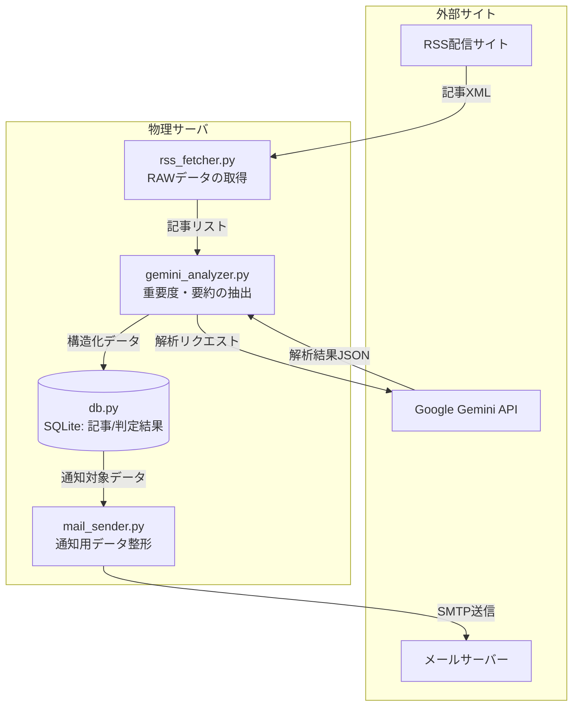

# IT News Auto-Collector & Delivery System

## 1. 概要
特定のITニュースサイトからRSSを自動取得し、Gemini APIによる要約および重要度判定を通じてニュースの取捨選択を自動化。抽出した重要情報をデータベースに蓄積し、メール通知までを一貫して行う自律型システム。

### 🎯 解決できる課題
- 複数のニュースサイトを毎日チェックする手間を削減したい  
- 重要な情報だけを効率よく収集したい  
- 最新のITトレンドを自動で把握したい  

本システムにより、ニュース収集〜重要度判定〜通知までを自動化し、情報収集にかかる時間を大幅に削減できます。

---

### 👤 想定ユーザー
- IT業界のトレンドを追いたいエンジニア  
- 情報収集を効率化したいビジネスパーソン  
- ニュース収集・分析を自動化したい企業  

---

### 🔧 カスタマイズ例
- 特定ジャンル（AI / Web3 など）のみ収集  
- Slack / LINE / Discord への通知連携  
- 重要度判定ロジックの調整  
- 社内システムやデータ基盤との連携  

---

### 🚀 導入イメージ
1. 環境構築（APIキー・メール設定など）  
2. cronによる定期実行設定  
3. 自動でニュース収集・分析・通知が開始  

## 2. 特徴・主な機能
- **RSSフィードの自動取得**  
  特定のITニュースサイトのRSSフィードを定期的に取得し、最新記事を自動収集する仕組みを構築。
- **Gemini APIによる記事分析**  
  複数の記事データをJSON形式に整形し、Gemini APIへ一括送信。記事ごとに以下の情報を自動生成。  
  また、重要度の閾値を設定することで関心の高いニュースのみを抽出可能。  
  - 記事データ要約（summary）  
  - 重要度スコア（importance）  
  - 評価理由（reason）  
  - 技術カテゴリ（category）  
- **SQLiteでのデータ管理**  
  取得した記事およびAI分析結果をSQLiteに保存し、以下を実現。  
  - URLのユニーク制約による重複排除  
  - 最新記事を指定件数取得し、未分析記事のみを抽出（効率的なバッチ処理）  
  - 要約・スコア・理由・技術カテゴリの永続化  
  - 過去データを活用した重要ランキングの生成  

- **メール通知機能**  
  重要度が一定以上の記事を抽出し、Gmail経由で指定アドレスへ通知。記事の要約・スコア・URLを含む形式で配信。

- **完全自動運用**  
  cronを利用して定期実行を行い、「取得 → 分析 → 通知」までを完全自動化。  

- **ログの監視**  
  loggingモジュールを用いて処理状況を記録。  
  - 処理成功／失敗の可視化  
  - エラー発生時の迅速な原因特定  
  - トラブルシューティング性向上  

### 💡 工夫した点
- モジュールごとに責務を分離し、保守性・拡張性を意識した設計  
- URLのユニーク制約によるデータ整合性の担保  
- 未分析データのみを対象とした効率的なバッチ処理設計  
- 環境変数によるセキュアな認証情報管理  
- ログによる運用監視・トラブルシューティング性の向上  
- 将来的な機能追加（通知先変更・API切替）を想定した構成  

## 3.使用技術
- **Language**: Python 3.12
- **Libraries/Frameworks**  
    - feedparser（RSS取得）
	- sqlite3（データベース管理）
	- google / google.genai（Gemini API連携）
	- logging（ログ管理）
	- dataclasses（データ構造定義）
	- python-dotenv（環境変数管理）
	- smtplib / email（メール送信）
- **Standard Libraries**:
	- json / os / pathlib / datetime

## 4.インフラ構成   
- **Self-Hosted Linux Server**  
  自宅に構築した物理サーバー（WSL 2 / Ubuntu）で運用  

- **Environment**  
  Python仮想環境（venv）  

- **Task Scheduler**  
  cronによる定期実行（1日1回のバッチ処理）  

- **Hardware Context**
  - Ryzen 7 / 64GB RAM 搭載 mini PCを24時間常時稼働  
  - 将来的な並列処理や負荷増加を見据えた構成 

### データフロー構成図

### モジュール構成図

