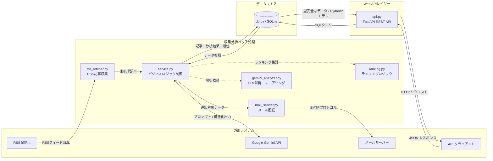
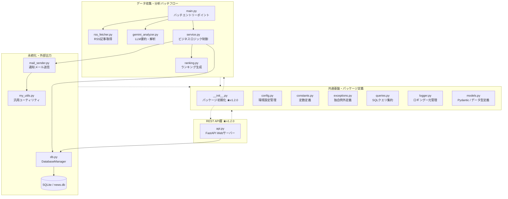

<div id="top"></div>

# IT News Auto-Collector & Delivery System

**Version 1.2.1** —  公開日時の正規化と段階的鮮度係数によるランキングアルゴリズムを導入。ニュース特性に適した記事順位付けを実現した、REST API 統合済みの自律型バッチシステム。


<p style="display: inline">
  
  
  
  
  
</p>

---

## 目次

1. [はじめに](#はじめに)
2. [プロジェクトについて](#プロジェクトについて)
3. [運用ワークフロー](#運用ワークフロー)
4. [ビジネス上の価値](#ビジネス上の価値)
5. [バージョン履歴と改善点](#バージョン履歴と改善点)
6. [環境](#環境)
7. [アーキテクチャ](#アーキテクチャ)
8. [工夫した点・アピールポイント](#工夫した点アピールポイント)
9. [リポジトリ構成](#リポジトリ構成)
10. [セットアップと実行](#セットアップと実行)
11. [トラブルシューティング](#トラブルシューティング)
12. [ライセンス・連絡](#ライセンス連絡)

---

## はじめに

**バックエンド寄りの Python 製オートメーション**として公開しているポートフォリオ用リポジトリです。マネージドクラウドに縛られない **自ホストで完結する設計** と、**LLM を業務フローに組み込んだ処理**、さらに **FastAPI による REST API 層の追加** を示す目的でまとめています。

| 対象者 | 参照箇所 |
|--------|----------|
| **採用・発注担当** | [ビジネス上の価値](#ビジネス上の価値) → [バージョン履歴](#バージョン履歴と改善点) → [工夫した点・アピールポイント](#工夫した点アピールポイント) → [環境](#環境) |
| **クライアント（非エンジニア）** | [プロジェクトについて](#プロジェクトについて) → [ビジネス上の価値](#ビジネス上の価値) → [運用イメージ](#運用イメージ) |
| **開発者・共同作業者** | [リポジトリ構成](#リポジトリ構成) → [セットアップと実行](#セットアップと実行) → [トラブルシューティング](#トラブルシューティング) |

---

## プロジェクトについて

複数の IT ニュースソース（RSS）から記事を **自動取得** し、**Google Gemini API** で要約・重要度スコア・技術カテゴリの付与を行います。取得した記事を SQLite に蓄積し、**重要度と鮮度係数を組み合わせたランキングアルゴリズム** により期間内トップ記事を算出したうえで、しきい値を超えた記事のみ **Gmail（SMTP）で通知** します。また、v1.2.0 からは **FastAPI による REST API** を追加し、バッチ処理と並行して蓄積データを外部から取得できる構造へと進化しています。

<p align="right">(<a href="#top">トップへ</a>)</p>

---
## 運用ワークフロー

### システム概要(System Overview)
1. 指定時刻にバッチが起動する。
2. RSS から新規記事を取り込み、未分析記事を Gemini で処理する。
3. ランキングを更新し、通知条件を満たす記事があればメールを送る。
4. API サーバーを常時起動しておくことで、蓄積されたランキング・通知候補を REST 経由でいつでも取得できる。
5. ログファイルで成功・失敗を追跡する。

## ワークフロー
- 定期実行 (Scheduler): cronによるバッチ処理
- 処理パイプライン: RSS取得 → SQLite保存 → Gemini分析 → ランキング生成
- データ提供: FastAPI (Port: 8080) を介したREST API

<p align="right">(<a href="#top">トップへ</a>)</p>

## ビジネス上の価値

- **時間削減**: 毎日のニュースサイト巡回と取捨選択を自動化します。
- **意思決定の補助**: 記事の要約・重要度スコア・公開日時を組み合わせたランキングにより、キャッチアップの優先順位が明確になります。
- **再現性**: 記事の選別ルールを設定することで、毎回同じ基準でスクリーニングが可能です。
- **外部連携性（v1.2.0〜）**: REST API 経由でランキング・通知候補を取得できるため、ダッシュボードや他システムとの連携基盤として機能します。
- **運用しやすさ**: ログローテーション、環境変数による秘密情報の分離、モジュール分割による保守性を意識した構成です。

<p align="right">(<a href="#top">トップへ</a>)</p>

---

## バージョン履歴と改善点

### v1.2.1 での改善点

**バージョン概要**

v1.2.1 では、ニュースランキングの品質向上を目的として、公開日時の正規化と段階的鮮度係数を用いたランキングアルゴリズムを導入しました。これにより、新しい記事を優先しつつ、一定期間経過後は急速に順位が低下する、ニュースの時間的価値を反映したランキングを実現しています。

| 改善内容 | 詳細 |
|---------|------|
| **ランキングアルゴリズムの改善** | 段階的鮮度係数モデルを適用し、重要度の変化が公開直後の記事は緩やかに減衰、4日目以降は急激に減衰するアルゴリズムを実装 |
| **公開日時の正規化** | RSSの日時文字列（RFC 2822形式）をSQLiteで扱いやすい日時形式（YYYY-MM-DD HH:MM:SS）へ変換して保存するよう修正 |
| **ランキングスコアの導入** | 重要度と鮮度係数から rank_score を算出し、順位決定に利用 |
| **ランキングの安定化** | 同一スコアの記事は現在の時刻を基準として、公開日時（同日の場合はIDの降順）を降順に並び替え、順位の再現性を確保 |
| **メール通知の改善** | メール本文に記事の公開日時を追加し、ランキング結果の鮮度を確認できる仕様に改善 |

### Version History

```
v1.0    コア機能完成
        - RSS取得 / SQLite保存 / Geminiによるニュース評価
        - ランキング生成 / メール配信

v1.1    設計・アーキテクチャ改善
        - DatabaseManagerによるDB層の整理
        - service層の導入（ビジネスロジックの分離）
        - 依存注入パターンの導入
        - モジュール間の責務を明確化

v1.1.1  堅牢性の向上・リファクタリング
        - Gemini APIリトライ処理、設定値の妥当性検証
        - 定数/クエリ/例外モジュールの分離
        - DatabaseManagerのコンテキストマネージャー対応

v1.2.0  REST API化
        - FastAPIによるREST API化（GET /v1/rankings, GET /v1/notifications）
        - Pydantic v2レスポンスモデル統合
        - SQLパラメータの名称分離・安全性向上
        - 絶対インポートへの刷新による可読性向上
        - __init__.py の適切な配置によるパッケージ化
        - CORS（Cross-Origin Resource Sharing）の適切な設定

v1.2.1 ランキングアルゴリズムの改善・公開日時の正規化(最新)
        - ランキングアルゴリズムの改善(段階的鮮度係数モデル)
        - 公開日時の正規化（RFC 2822 → `YYYY-MM-DD HH:MM:SS`）
        - `rank_score` の導入（重要度 × 鮮度係数を算出しDBに保存）
        - 同一スコア時の並び順安定化（優先順位：重要度 > 公開日時 > ID）
        - メール本文に、記事の公開日時の項目を追加

v2.0    運用・拡張（予定）
        - 非同期処理（async/await）の全面導入
        - Dockerコンテナ化
        - Web UIの構築
```

<p align="right">(<a href="#top">トップへ</a>)</p>

---

## 環境

**前提**: Python 3.12 以上が必要です。

| ライブラリ | バージョン | 用途 |
|-----------|-----------|------|
| Python | 3.12 | 実行環境 |
| fastapi | 最新安定版 | REST API フレームワーク（★v1.2.0追加） |
| feedparser | 6.0.12 | RSS取得・パース |
| requests | 2.32.5 | HTTP通信 |
| python-dotenv | 1.2.1 | 環境変数管理 |
| pydantic | 2.12.5 | データバリデーション・モデル定義（★v1.2.0追加） |
| google-genai | 1.62.0 | Gemini API クライアント |
| tenacity | 9.1.2 | リトライ処理 |
| tqdm | 4.67.3 | 進捗表示 |
| websockets | 16.0 | WebSocket通信 |

その他の標準ライブラリ（`sqlite3` / `smtplib` / `logging`）は Python 付属のため別途インストール不要です。

<p align="right">(<a href="#top">トップへ</a>)</p>

---

## アーキテクチャ

### データフロー



### モジュール構成（概念）



<p align="right">(<a href="#top">トップへ</a>)</p>

---

## 工夫した点・アピールポイント

### 1. 変化に強いクリーンな「レイヤードアーキテクチャ」の採用

```
Presentation / API 層  （api.py — FastAPI エンドポイント）
       ↓
Service 層            （service.py — ビジネスロジック）
       ↓
Data 層               （db.py — DB・永続化）
       ↓
Infrastructure 層     （外部API・ログ・設定）
```

ビジネスロジック（Service 層）、データアクセス（DB 層）、データモデル（Models）を明確に分離しているため、層単位でのテストが可能になり、機能追加時の影響範囲が限定されます。

#### ★【v1.2.0 成果】
- **柔軟なコンポーネント拡張**: 徹底した責務分離により、既存のバッチ処理ロジックに大幅な変更を加えることなく、独立したコンポーネントとして「FastAPI による REST API 機能」を迅速に統合できました。
- **インポート探索の適正化**: プロジェクト全体の構造化にあたり、各ディレクトリに `__init__.py` を適切に配置して完全パッケージ化しました。環境依存によるパス解決エラーを排除するため、プロジェクトルートを起点とする厳格な絶対インポート表記へと全面刷新し、実行時の安定性を向上させました。

### 2. 本番運用を想定した「堅牢性・例外ハンドリング」の徹底

- **フェイルファスト(Fail-Fast)設計**: 起動直後に `validate_config()` で設定値の妥当性を検証し、不完全な状態での稼働を初期段階で遮断することで、本番環境でのデータ破損やクラッシュを未然に防ぎます。
- **コンテキストマネージャーによるリソース管理**: `DatabaseManager` に `with` 構文を実装することで、例外発生時でも確実にDB接続をクローズし、コネクションリークを防ぐ堅牢なリソース解放処理を担保しました。
- **依存注入（Dependency Injection）パターン**: 依存関係をコンストラクタ経由で注入可能にすることで、テスト時のモック差し替えを容易にし、テスト容易性（Testability）を確保しています。

```python
# 依存をコンストラクタで受け取る — テスト時はモック化が容易
service = NewsService(database_manager=db)
service = NewsService(database_manager=MockDatabase())
```

### 3. 安全かつ適正な「パラメータ管理とデータベースセキュリティ」

SQL インジェクションを根絶するため、SQLite への全アクセスに**名前付きプレースホルダーを用いた動的パラメータバインディング**を徹底しています。

#### ★【v1.2.0 成果】
- **変数の明示的スコープ分離**: ランキング生成クエリ（上限10件）と通知対象取得クエリ（上限5件）において、混同しやすかった制限値パラメータをそれぞれ `:ranking_limit` / `:notification_limit` へと明示的に分離し、クエリバグや設定漏れを構造的に防ぐ防御的プログラミングを実践しています。

### 4. Web APIにおける「データ検証とWebセキュリティ」【★v1.2.0 新設】

- **Pydantic v2 による型安全なレスポンスモデル適用**: FastAPIの `response_model` スキーマを厳格に定義し、DBから取得した生レコードをそのまま返却せず、必要な情報のみを自動バリデーションして返す設計により、内部データ構造の隠蔽（情報漏洩防止）と型安全性を両立しました。
- **CORSMiddlewareの適正制御**: 将来的なフロントエンド(React/Vue等)や外部ダッシュボードからのオンデマンドな接続を考慮し、CORS（Cross-Origin Resource Sharing）を導入しました。セキュリティリスクを最小限に抑えるため、接続オリジンや許可メソッドのスコープを適切に制限する防御的設計を施しています。

### 5. ニュース特性を反映した「ランキングアルゴリズムの設計」【★v1.2.1 新設】

記事の重要度だけでなく、**記事の鮮度（公開からの経過時間）を加味した段階的鮮度減衰モデル**を独自設計しました。

- **段階的鮮度係数モデルの実装**: 公開日時の時間を経るごとにスコアが低下するアルゴリズムを実装しました。また、記事の重要度スコアと鮮度係数から `rank_score` を 算出することで、記事の時間的価値を順位に反映しています。
- **公開日時の正規化**: RSS の日時文字列（RFC 2822 形式）を `YYYY-MM-DD HH:MM:SS`(ISO8601) 形式に変換し、DBに統一して保存することで、クエリの安定性と可読性を向上させました。
- **同一スコア時の安定ソート**: 公開日時 → ID の優先順位で並び順を確定させ、実行タイミングに影響されない一貫したランキング結果を保証しています。

<p align="right">(<a href="#top">トップへ</a>)</p>

---

## リポジトリ構成

```
it-news-system/
├── README.md
├── requirements.txt
├── src/
│   ├── main.py             # エントリポイント（バッチ処理）
│   ├── __init__.py         # パッケージ初期化（★v1.2.0追加）
│   ├── api.py              # FastAPIサーバー・エンドポイント定義（★v1.2.0追加）
│   ├── service.py          # 収集〜分析〜ランキングのオーケストレーション
│   ├── ranking.py          # ランキング生成ロジック
│   ├── gemini_analyzer.py  # Gemini APIによるAI分析
│   ├── rss_fetcher.py      # RSS取得
│   ├── db.py               # DB操作（コンテキストマネージャー対応）
│   ├── mail_sender.py      # メール送信処理
│   ├── models.py           # Pydantic・データモデル定義
│   ├── config.py           # パス・API・通知しきい値など
│   ├── constants.py        # アプリケーション定数定義
│   ├── exceptions.py       # カスタム例外定義
│   ├── queries.py          # データベースクエリ定義
│   ├── logger.py
│   └── my_utils.py         # SMTP送信ヘルパ
├── data/                   # SQLite 等（.gitignore 推奨）
│   └── news.db 
└── logs/                   # ログ出力先
    └── it_news_system.log
```

<p align="right">(<a href="#top">トップへ</a>)</p>

---

## セットアップと実行

### 1. 仮想環境の作成とパッケージのインストール
システム環境を汚染しないよう仮想環境を構築し、必要な依存パッケージを一括インストールします。

```bash
# 仮想環境（.venv）の作成
python3.12 -m venv .venv

# 仮想環境の有効化
source .venv/bin/activate

# パッケージのインストール
pip install -r requirements.txt
```

### 2. 環境変数の設定

プロジェクトのルートディレクトリに `.env `ファイルを新規作成し、各種認証情報を記述します。

```
GEMINI_API_KEY=your-gemini-api-key
GMAIL_USER=your-email@gmail.com
GMAIL_PASS=your-app-password
```

#### 環境変数一覧

| 変数名 | 役割 | 備考 |
|--------|------|------|
| `GEMINI_API_KEY` | Gemini API の認証キー | Google AI Studio で発行 |
| `GMAIL_USER` | 送信元 Gmail アドレス | 自身の取得アドレスを記載|
| `GMAIL_PASS` | Gmail の SMTP 用パスワード | アプリパスワードを推奨 |

#### アプリケーション内部動作設定（src/config.py）
システム運用の最適化やチューニングは、`config.py` 内の以下の定数を調整することで制御可能です。

| 変数名 | 役割 | 推奨設定値 |
|--------|------|-------------------|
| `DEFAULT_MIN_IMPORTANCE` | 配信対象（重要度）のしきい値（1〜10） |` 7`（厳選されたニュースのみを抽出） |
| `NOTIFICATION_LOOKBACK_DAYS` | 過去何日分の未処理記事をスコアリング対象とするか | `7`（1週間分のフィードをカバー） |
| `NOTIFICATION_LIMIT` | 1度に送る最大記事数 | `5` （可読性を維持するための上限値）|

### 3. 永続化およびログ用ディレクトリの自動・手動展開
起動時の初期バリデーションエラー（Fail-Fast）を回避するため、実行前にデータストアおよびログ出力用のストレージ領域を必ず確保します。

```bash
# プロジェクトルートで実行
mkdir -p data logs
```

### 4. ニュース収集・分析バッチの実行
プロジェクトルートを起点としたパッケージ指定により、インポート探索エラーを起こすことなくバッチ処理パイプラインを起動します。

```bash
# 常にプロジェクトルートからモジュール指定で実行
python -m src.main
```

### 5. web API サーバーの起動（★v1.2.0）
fastapi dev コマンドを使用し、開発用のライブリロードサーバーを立ち上げます。絶対インポートパスの名前空間（src.api）を維持するため、ルートからの相対パスとしてファイルを指定します。

```bash
# プロジェクトルートからモジュール空間を維持したまま起動。環境上のポート競合を避けるため 8080 に設定
fastapi dev ./src/api.py　--port 8080
```

起動後、ブラウザで `http://localhost:8080/docs` を開くと自動生成された Swagger UI から各エンドポイントに対してインタラクティブなマニュアルテスト（Try it out）が行えます。

#### 公開APIエンドポイント一覧
| エンドポイント | メソッド | 概要 |
|--------------|---------|------|
| `/v1/rankings` | GET | 直近のバッチでスコアリングされた、高重要度記事のランキング一覧を取得|
| `/v1/notifications` | GET | 定めたしきい値（重要度等）を満たした、通知対象記事の最新スナップショットを取得|
| `/docs` | GET | Swagger UI（仕様確認・対話型APIテストクライアント） |

### 6. 生産環境での定期自動実行（cron）の設定例
Linux環境での定期運用（例：毎日午前9時にバッチを無人実行）を行う場合は、絶対パスと仮想環境内のPythonバイナリを直接指定し、カレントディレクトリに依存しない形での解決を徹底します。
```
0 9 * * * cd path/to/it-news-system && ./.venv/bin/python3 -m src.main >> path/to/it-news-system/logs/it_news_system.log 2>&1
```

<p align="right">(<a href="#top">トップへ</a>)</p>

---

---

## トラブルシューティング

### `data/` または `logs/` が無い

SQLite のパス（`data/news.db`）やログファイルはコード側でディレクトリを自動作成しません。**リポジトリ直下に `mkdir -p data logs` を用意**してから再実行してください。

### `.env` が読み込まれない／キーが空になる

`.env` は **プロジェクトルート**（`README.md` と同じ階層）に置いてください。`src/` 配下では読み込まれません。変数名の typo と値前後の余分な引用符も確認してください。

### `ModuleNotFoundError`

README どおり**リポジトリルートで** `python src/main.py` を実行してください。別ディレクトリから `python main.py` を実行すると `src` 内モジュールの解決に失敗します。

### API サーバーが起動しない

`fastapi` がインストールされているか確認してください（`pip install -r requirements.txt` を再実行）。ポート競合の場合は `fastapi dev src/api.py --port 8001` のように変更してください。

### RSS が取得できない・件数が常に少ない

ネットワーク（プロキシ・FW）と RSS URL の生存を確認してください。フィード側の障害時は時間を置いて再実行するか、タイムアウト設定を見直してください。

### Gemini API からエラーが返る

`GEMINI_API_KEY` の有効性とクォータを確認してください。429（レート制限）の場合は間隔を空けて再実行するか、1バッチあたりの記事数を下げてください。

### `database is locked`（SQLite）

同一マシン上で別プロセスが同じ `news.db` を開いています。他プロセスを終了してから再実行してください。

### メールが届かない

Gmail は**アプリパスワード**を使用してください。また、`IMPORTANCE_THRESHOLD` が高すぎて通知候補が 0 件になっていないか確認してください。

### cron で動かない

実行ファイルや仮想環境の Python を**フルパス**で指定してください（例: `.venv/bin/python`）。

### ログの確認方法

`logs/it_news_system.log` にローテーション付きログが出力されます。異常時はスタックトレースと直前の INFO ログを突き合わせてください。

<p align="right">(<a href="#top">トップへ</a>)</p>

---

## ライセンス・連絡

リポジトリにライセンスファイルを置く場合は、そのファイルに従ってください。案件相談・ポートフォリオに関する連絡は、プロフィールに記載の連絡先までお願いします。