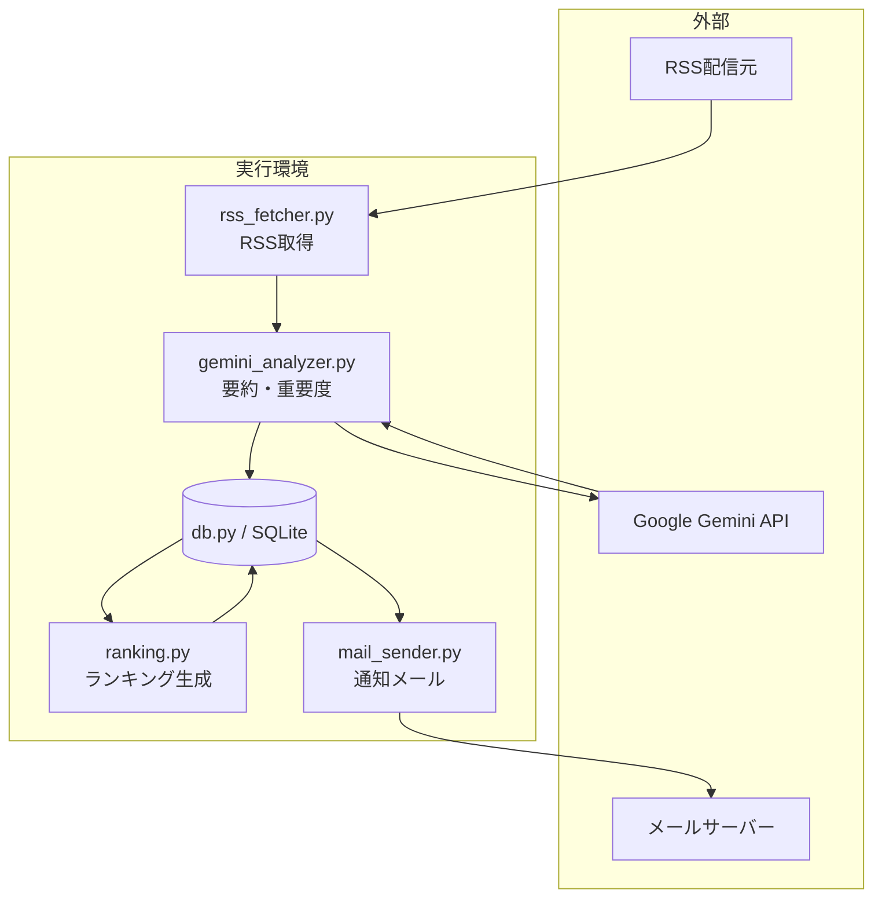
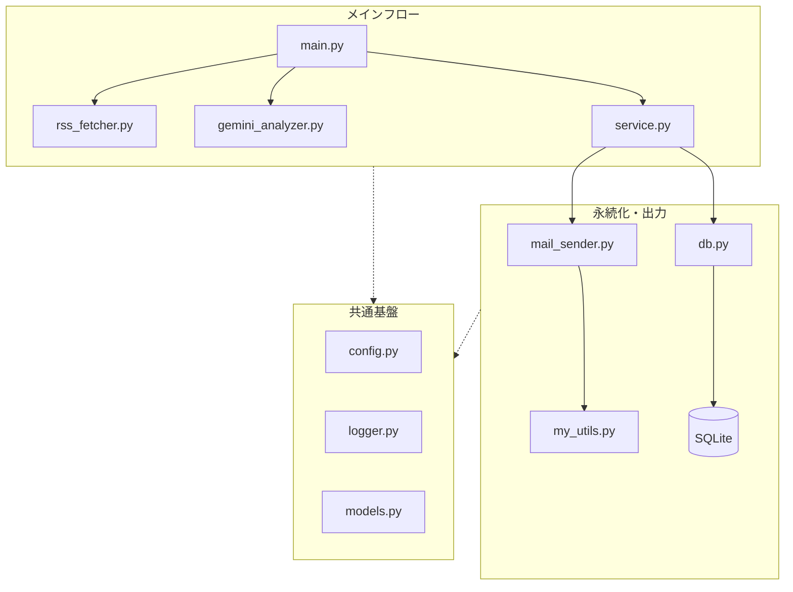

<div id="top"></div>

# IT News Auto-Collector & Delivery System

## 使用技術一覧

<p style="display: inline">
  
  
  
  
</p>

---

## 目次

1. [はじめに](#はじめに)
2. [プロジェクトについて](#プロジェクトについて)
3. [ビジネス上の価値](#ビジネス上の価値)
4. [v1.0のコア機能](#v10で実装したコア機能)
5. [環境](#環境)
6. [アーキテクチャ](#アーキテクチャ)
7. [リポジトリ構成](#リポジトリ構成)
8. [セットアップと実行](#セットアップと実行)
9. [運用イメージ](#運用イメージ)
10. [今後の拡張例](#今後の拡張例)
11. [トラブルシューティング](#トラブルシューティング)
12. [ライセンス・連絡](#ライセンス連絡)

---

## はじめに

**バックエンド寄りの Python 製オートメーション**として公開しているポートフォリオ用リポジトリです。マネージドクラウドに縛られない **自ホストで完結する設計** と、**LLM を業務フローに組み込んだ処理** を示す目的でまとめています。

| 対象者 | 参照箇所 |
|--------|----------|
| **採用・発注担当** | [ビジネス上の価値](#ビジネス上の価値) → [v1.0のコア機能](#v10で実装したコア機能) → [環境](#環境) → [アーキテクチャ](#アーキテクチャ) |
| **クライアント（非エンジニア）** | [プロジェクトについて](#プロジェクトについて) → [ビジネス上の価値](#ビジネス上の価値) → [運用イメージ](#運用イメージ) |
| **開発者・共同作業者** | [リポジトリ構成](#リポジトリ構成) → [セットアップと実行](#セットアップと実行) → [トラブルシューティング](#トラブルシューティング) → 図（データフロー・モジュール） |

<p align="right">(<a href="#top">トップへ</a>)</p>

---

## プロジェクトについて

複数の IT ニュースソース（RSS）から記事を **自動取得** し、**Google Gemini API** で要約・重要度スコア・技術カテゴリの付与を行います。取得した記事を SQLite に蓄積し、**期間内トップ記事のランキング** を生成したうえで、しきい値を超えた記事のみ **Gmail（SMTP）で通知** します。人手による巡回と取捨選択を減らし、**「読むべき記事」が分かる状態** へ変換するパイプラインです。

<p align="right">(<a href="#top">トップへ</a>)</p>

---

## ビジネス上の価値

- **時間削減**: 毎日のニュースサイト巡回とユーザーの関心度が高い記事の取捨選択を自動化します。
- **意思決定の補助**: 記事の要約と重要度を数値化することで、キャッチアップの優先順位が付けやすくなります。
- **再現性**: 記事の選別ルールを設定することで、毎回同じ基準でスクリーニングが可能です。
- **運用しやすさ**: ログローテーション付きのファイルログ、環境変数による秘密情報の分離、モジュール分割による保守性を意識した構成です。

<p align="right">(<a href="#top">トップへ</a>)</p>

---

## v1.0で実装したコア機能

| 領域 | 内容 |
|------|------|
| **収集** | RSSフィードから記事メタデータを取得し、URL単位で重複排除しながらSQLiteへ保存。 |
| **要約・スコアリング** | システムプロンプトでユーザーの興味のある分野を分析し、それらに基づいてGemini APIで記事の日本語要約、1〜10の重要度判定、判定理由、技術カテゴリをJSON形式で取得し保存。 |
| **ランキング** | 直近N日の記事から重要度順にトップ10を算出し、`rankings`テーブルにバッチ単位で記録。 |
| **メール送信** | 過去N日・重要度しきい値以上の記事の中から最大M件を選び、件名・本文を組み立ててGmail経由でメール配信。 |

v1.0の範囲では、**定期実行（cron）・単一プロセスのバッチ**として完結させています。

<p align="right">(<a href="#top">トップへ</a>)</p>

---

## 環境

**前提**: Python 3.12 以上が必要です。

| 言語・ライブラリ | バージョン |
|------------------|------------|
| Python | 3.12 |
| feedparser | 最新版（requirements.txt 参照） |
| google-genai | 最新版（requirements.txt 参照） |
| python-dotenv | 最新版（requirements.txt 参照） |

その他の標準ライブラリ（`sqlite3` / `smtplib` / `logging`）はPython付属のため別途インストール不要です。

<p align="right">(<a href="#top">トップへ</a>)</p>

---

## アーキテクチャ

### データフロー



### モジュール構成（概念）



<p align="right">(<a href="#top">トップへ</a>)</p>

---

## リポジトリ構成

```
it-news-system/
├── README.md
├── requirements.txt      # 依存パッケージ一覧
├── src/
│   ├── main.py           # エントリポイント
│   ├── config.py         # パス・API・通知しきい値など
│   ├── rss_fetcher.py    # RSS取得
│   ├── gemini_analyzer.py
│   ├── ranking.py
│   ├── service.py        # 収集〜分析〜ランキングのオーケストレーション
│   ├── db.py
│   ├── mail_sender.py
│   ├── models.py
│   ├── my_utils.py       # SMTP送信ヘルパ
│   └── logger.py
├── data/                 # SQLite 等（.gitignore 推奨）
└── logs/                 # ログ出力先
```

<p align="right">(<a href="#top">トップへ</a>)</p>

---

## セットアップと実行

### 1. 仮想環境の作成とパッケージのインストール

```bash
python3.12 -m venv .venv
source .venv/bin/activate
pip install -r requirements.txt
```

### 2. 環境変数の設定

`.env` ファイルをプロジェクトルートに作成し、以下を設定してください。

```
GEMINI_API_KEY=your-gemini-api-key
GMAIL_USER=your-email@gmail.com
GMAIL_PASS=your-app-password
```

#### 環境変数一覧

| 変数名 | 役割 | 備考 |
|--------|------|------|
| `GEMINI_API_KEY` | Gemini API の認証キー | Google AI Studio で発行 |
| `GMAIL_USER` | 送信元 Gmail アドレス | |
| `GMAIL_PASS` | Gmail の SMTP 用パスワード | アプリパスワードを推奨（運用ポリシーに従ってください） |

### 3. `data/` と `logs/` の用意

初回実行前に、リポジトリ直下にディレクトリを用意してください（`config.py` の `DB_PATH`・`LOG_FILE` がこの前提です）。

```bash
mkdir -p data logs
```

### 4. バッチ実行

リポジトリのルートをカレントにして実行します（`python` が `src/main.py` の所在を解決できるようにするため）。

```bash
python src/main.py
```

### 5. 定期実行（cron）の設定例

```
0 8 * * * cd /path/to/it-news-system && .venv/bin/python src/main.py
```

通知の強さは `config.py` の `IMPORTANCE_THRESHOLD`、`NOTIFICATION_LOOKBACK_DAYS`、`MAX_NOTIFICATION_COUNT` などで調整できます。

<p align="right">(<a href="#top">トップへ</a>)</p>

---

## 運用イメージ

1. 指定時刻にバッチが起動する。
2. RSSから新規記事を取り込み、未分析分をGeminiで処理する。
3. ランキングを更新し、通知条件を満たす記事があればメールを送る。
4. ログファイルで成功・失敗を追跡する。

<p align="right">(<a href="#top">トップへ</a>)</p>

---

## 今後の拡張例

Slack / Discord 通知、ソースの追加、PostgreSQLへの移行、コンテナ化、API化、Webダッシュボード化など、**通知チャネルとデータ基盤の差し替え**を想定したモジュール分割にしています。

<p align="right">(<a href="#top">トップへ</a>)</p>

---

## トラブルシューティング

### `data/` または `logs/` が無くて失敗する

SQLite のパス（`data/news.db`）やログファイル（`logs/it_news_system.log`）はコード側でディレクトリを自動作成しません。**リポジトリ直下に `mkdir -p data logs` で用意**してから再実行してください。

### `.env` が読み込まれない／キーが空になる

- `.env` は **プロジェクトルート**（`README.md` と同じ階層）に置きます。`src/` 配下に置いていると読み込まれません。
- 変数名の typo（`GEMINI_API_KEY` など）と、値の前後に余分な引用符が無いか確認してください。[環境変数一覧](#環境変数一覧)を参照してください。

### `ModuleNotFoundError` など import で落ちる

READMEどおり **リポジトリルートで** `python src/main.py` を実行してください。別ディレクトリで `python main.py` だけ実行すると、`src` 内モジュールの解決に失敗することがあります。

### RSS が取得できない・件数が常に少ない

- 実行ディレクトリ以外の問題でなければ、**ネットワーク**（プロキシ・FW）と RSS URL の生存を確認してください。
- フィード側の障害やレート制限の際は、時間を置いて再実行するか、`config.py` / `rss_fetcher` 側の取得ロジック・タイムアウト設定を見直してください。

### Gemini API からエラーが返る

- `GEMINI_API_KEY` が有効か、Google AI Studio／課金・**クォータ**に達していないか確認してください。
- **429（レート制限）** の場合は間隔を空けて再実行するか、1 バッチあたりの記事数（`FETCH_LIMIT` など）を下げて負荷を抑えます。
- モデル ID（`config.py` の `MODEL_ID`）が利用可能な一覧と一致しているか確認してください。

### Gemini の戻りが JSON として解釈できない

プロンプトとモデルの出力がずれると解析に失敗することがあります。ログで該当記事を特定し、**温度 (`TEMPERATURE`) を下げる**、プロンプトで「JSON のみ」と強く固定する、**失敗時はスキップして次へ** など運用でカバーする想定です（必要なら `gemini_analyzer` のエラーハンドリングを強化）。

### `database is locked`（SQLite）

同一マシンで**別プロセスが同じ `news.db` を開いている**、またはディスク／NFS の遅延でロックが残っている場合に起こります。他プロセスを止めてから再実行するか、短時間後に再試行してください。定期実行の間隔を極端に短くしすぎないようにします。

### メールが届かない

- `GMAIL_USER` / `GMAIL_PASS` が正しいか確認してください。
- Gmail は **アプリパスワード** を使うのが一般的です（2 段階認証と組み合わせ）。通常のログインパスワードでは SMTP 認証に失敗します。
- `config.py` の **`IMPORTANCE_THRESHOLD` が高すぎて通知候補が 0 件**になっていないか、`NOTIFICATION_LOOKBACK_DAYS`・`MAX_NOTIFICATION_COUNT` と合わせて確認してください。
- 迷惑メールフォルダや、送信元・送信先の同一アドレスによるフィルタも確認してください。

### cron で動かない・ログに何も残らない

- cron の環境は対話シェルと異なり **`PATH` が短い**ことがあります。**仮想環境の Python をフルパス**で指定してください（README の例: `.venv/bin/python`）。
- `cd /path/to/it-news-system` を必ず先頭に付け、**作業ディレクトリと `.env` の位置**がずれないようにします。
- 標準出力を捨てている場合は `/path/to/logs/cron.log` へリダイレクトすると切り分けが容易です。

### ログの確認方法

`logs/` 以下にローテーション付きログ（`it_news_system.log` など）が出力されます。**異常時はまずここ**を確認し、スタックトレースと直前の INFO を突き合わせてください。

<p align="right">(<a href="#top">トップへ</a>)</p>

---

## ライセンス・連絡

リポジトリにライセンスファイルを置く場合は、そのファイルに従ってください。案件相談・ポートフォリオに関する連絡は、ご利用のプロフィール（求人媒体・SNS 等）に記載の連絡先までお願いします。