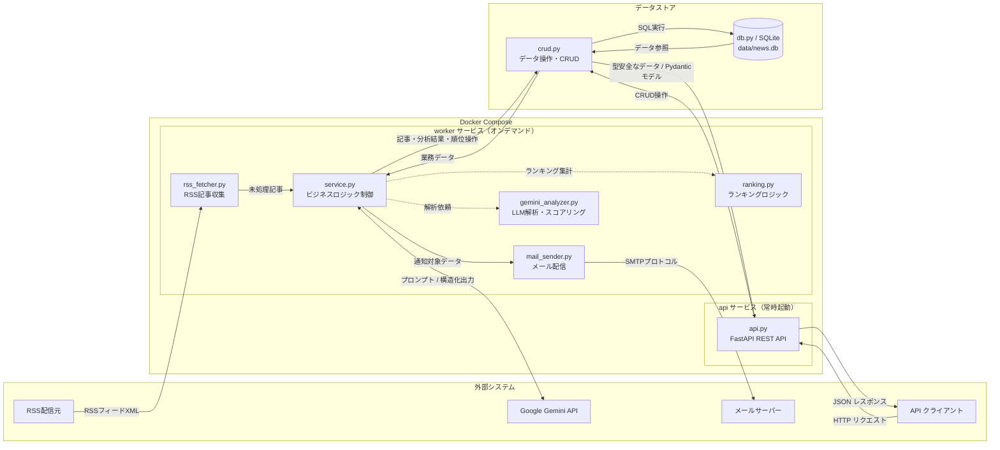
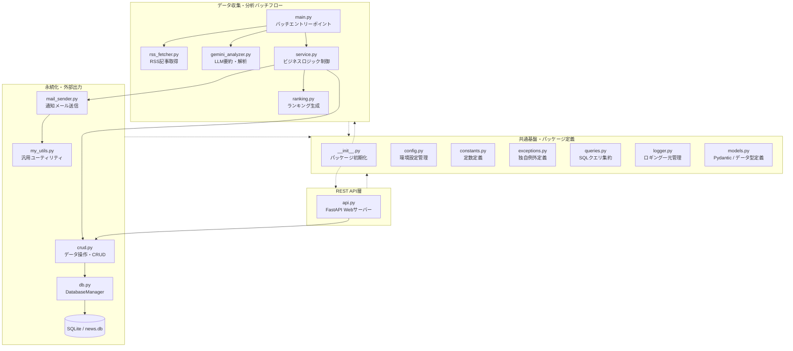

<div id="top"></div>

# IT News Auto-Collector & Delivery System

**Version 1.4.0** — パーソナライズ機能用APIの追加、カテゴリー選択・記事「いいね」対応、データベース整合性と安定性の強化、データ操作ロジックのモジュール分離など、大幅な拡張・改善を実施。

<p style="display: inline">
  
  
  
  
  
  
</p>

---

## 目次

1. [はじめに](#はじめに)
2. [プロジェクトについて](#プロジェクトについて)
3. [運用ワークフロー](#運用ワークフロー)
4. [ビジネス上の価値](#ビジネス上の価値)
5. [バージョン履歴と改善点](#バージョン履歴と改善点)
6. [環境](#環境)
7. [アーキテクチャ](#アーキテクチャ)
8. [工夫した点・アピールポイント](#工夫した点アピールポイント)
9. [リポジトリ構成](#リポジトリ構成)
10. [Dockerfile の設計](#dockerfile-の設計)
11. [セットアップと実行](#セットアップと実行)
12. [トラブルシューティング](#トラブルシューティング)
13. [ライセンス・連絡](#ライセンス連絡)

---

## はじめに

**バックエンド寄りの Python 製オートメーション**として公開しているポートフォリオ用リポジトリです。マネージドクラウドに縛られない **自ホストで完結する設計**、**LLM を業務フローに組み込んだ処理**、**FastAPI による REST API 層**、そして **Docker による再現可能な実行環境** を示す目的でまとめています。

| 対象者 | 参照箇所 |
|--------|----------|
| **採用・発注担当** | [ビジネス上の価値](#ビジネス上の価値) → [バージョン履歴](#バージョン履歴と改善点) → [工夫した点・アピールポイント](#工夫した点アピールポイント) → [環境](#環境) |
| **クライアント（非エンジニア）** | [プロジェクトについて](#プロジェクトについて) → [ビジネス上の価値](#ビジネス上の価値) → [運用ワークフロー](#運用ワークフロー) |
| **開発者・共同作業者** | [リポジトリ構成](#リポジトリ構成) → [Dockerfile の設計](#dockerfile-の設計) → [セットアップと実行](#セットアップと実行) → [トラブルシューティング](#トラブルシューティング) |

---

## プロジェクトについて

ITニュースの自動収集・AI分析・配信を行うバックエンドシステムです。

- **コア機能**: RSS取得、記事の要約・スコアリング、重要度ベースのメール通知、ユーザーごとの関心トピックや「いいね」保存
- **API提供**: FastAPIによるREST APIのほか、IT分野カテゴリ一覧やユーザー設定・フィードバックのAPIを新設
- **運用設計**: Dockerによる環境分離、ヘルスチェック監視、自動復旧、DB外部キー制約と接続管理の堅牢化
- **高度な拡張**: パーソナライズランキング、高度な分析パイプライン、CRUD処理の専用モジュール分離による保守性向上

<p align="right">(<a href="#top">トップへ</a>)</p>

---

## 運用ワークフロー

### システム概要 (System Overview)

1. `docker compose up -d` で API サーバー（`api` サービス）を常時起動する。
2. 必要に応じて `docker compose run --rm worker` で収集・分析バッチを実行する。
3. RSS から新規記事を取り込み、未分析記事を Gemini で処理する。
4. ランキングを更新し、通知条件を満たす記事があればメールを送る。
5. ホストマウントされた `data/news.db` を介して、API サーバーから蓄積データを REST 経由で取得できる。
6. ログファイルで成功・失敗を追跡する。

### ワークフロー

- **コンテナ基盤**: Docker Compose v2（`api` 常時起動 / `worker` オンデマンド実行）  
  永続DB接続と外部キー整合性の強化、接続管理の安全化・バッチ自動化にも柔軟対応。
- **処理パイプライン**: RSS 取得 → SQLite 保存 → Gemini 分析 → ランキング生成 → メール配信  
  ユーザーごとの関心トピック・いいね保存を組み込んだパーソナライズAPIを追加、個別最適化が可能に。
- **データ提供**: FastAPI (Port: 8080) を介した REST API  
  カテゴリ一覧・ユーザー設定・フィードバックAPI追加、CRUD分離による構造化と堅牢化。

<p align="right">(<a href="#top">トップへ</a>)</p>

---

## ビジネス上の価値

- **時間削減**: 毎日のニュースサイト巡回と取捨選択を自動化します。複数ニュースソースに対するバッチ処理と一括分析で情報取得をさらに効率化しました。
- **意思決定の補助**: 記事の要約・重要度スコア・公開日時を組み合わせたランキングにより、キャッチアップの優先順位が明確になります。パーソナライズされたスコアリングで、より個人に合った情報を提示します。
- **再現性**: 記事の選別ルールを設定することで、毎回同じ基準でスクリーニングが可能です。失敗時の自動リトライと記録保持によりバッチの挙動が安定しています。
- **外部連携性**: REST API 経由でランキング・通知候補を取得できるため、ダッシュボードや他システムとの連携基盤として機能します。API構造の堅牢化により信頼性・拡張性が向上しています。
- **運用しやすさ**: ログローテーション、環境変数による秘密情報の分離、モジュール分割による保守性、Docker による環境の再現性を意識した構成です。バッチとサービスの役割分離でトラブルシューティングや運用改善が容易になりました。

<p align="right">(<a href="#top">トップへ</a>)</p>

---

## バージョン履歴と改善点

### v1.4.0 での改善点【最新】

| 改善内容 | 詳細 |
|---------|------|
| **パーソナライズ機能用のAPIエンドポイントを追加** | ユーザーごとの関心トピック保存と記事への「いいね」に対応するパーソナライズAPIのエンドポイント（`/v1/categories`, `/v1/users/preferences`, `/v1/articles/{article_id}/like`）を追加して実装 |
| **ユーザー管理・フィードバック用DBスキーマの追加** | `users` / `user_preferences` / `article_feedbacks` テーブルを新設し、外部キー制約で不整合防止。設定保存時に未登録ユーザーなら自動生成（`ENSURE_USER`実装） |
| **データ操作（CRUD）ロジックの独立** | `crud.py` を新設し、記事・ユーザー設定・フィードバック等、DB操作ロジックを一元管理 |
| **データ検証用モデルの追加** | `UserPreference` / `ArticleFeedback` dataclass および Pydantic モデルでデータ検証を強化 |
| **DB接続のライフサイクル管理と堅牢化** | `DatabaseManager` は接続/スキーマ/バッチ処理専用に、CRUDは専用モジュールに分離。安全な接続管理コンテキストマネージャ導入、FastAPI 側もセッションを自動クローズするように変更。またSQLiteで `PRAGMA foreign_keys = ON` 有効化による全テーブル間の参照安全性保証 |
| **既存APIの仕様スリム化と初期UXの最適化** | 既存API（`GET /news`）の `skip` パラメータ廃止&初回デフォルトを `limit=10`・`min_importance=7` へ変更し、初回UX最適化・デッドコード撲滅 |


### Version History

```
v1.0    コア機能完成

v1.1    設計・アーキテクチャ改善

v1.1.1  堅牢性の向上・リファクタリング

v1.2.0  REST API化

v1.2.1  ランキングアルゴリズムの改善・公開日時の正規化

v1.3.0  Docker コンテナ化

v1.3.1  サービス信頼性の強化

v1.3.2  マルチソース収集とパーソナライズ
        - TechCrunch / The Verge / Ars Technica / GitHub Blog の追加
        - USER_PREFERENCES による関心トピック連動スコアリング
        - parse_rss_date による日付パースの堅牢化
        - 全ソース集約後の一括分析・ランキングフロー
        - Gemini リトライ強化（503 対応・指数バックオフ・ダミーレコード）
        - article_id 重複防止と UNIQUE 制約の追加

v1.4.0 フロントエンド連携を見据えたパーソナライズAPIの実装とDB基盤の堅牢化
        - パーソナライズ機能用のAPIエンドポイントを追加
        - ユーザー管理・フィードバック用DBスキーマの追加
        - データ操作（CRUD）ロジックの独立
        - データ検証用モデルの追加
        - DB接続のライフサイクル管理と堅牢化
        - 既存APIの仕様スリム化と初期UXの最適化

v2.0    運用・拡張（予定）
        - Slack / Discord 通知
        - GitHub リリースタグの作成と CHANGELOG の固定（Git 運用の仕上げ）
        - 非同期処理（async/await）の全面導入
        - Web UI の構築
```

<p align="right">(<a href="#top">トップへ</a>)</p>

---

## 環境

### 実行基盤（推奨）

| コンポーネント | バージョン | 用途 |
|--------------|-----------|------|
| Docker Engine | v25.0 以上推奨 | コンテナ実行環境 |
| Docker Compose | v2.0 以上 | マルチサービス管理 |

### アプリケーションスタック

| ライブラリ | バージョン | 用途 |
|-----------|-----------|------|
| Python | 3.12 | 実行環境（コンテナ内） |
| fastapi | 最新安定版 | REST API フレームワーク |
| feedparser | 6.0.12 | RSS 取得・パース |
| requests | 2.32.5 | HTTP 通信 |
| python-dotenv | 1.2.1 | 環境変数管理 |
| pydantic | 2.12.5 | データバリデーション・モデル定義 |
| google-genai | 1.62.0 | Gemini API クライアント |
| tenacity | 9.1.2 | リトライ処理 |
| tqdm | 4.67.3 | 進捗表示 |

その他の標準ライブラリ（`sqlite3` / `smtplib` / `logging`）は Python 付属のため別途インストール不要です。

<p align="right">(<a href="#top">トップへ</a>)</p>

---

## アーキテクチャ

### データフロー



### モジュール構成（概念）



<p align="right">(<a href="#top">トップへ</a>)</p>

---

## 工夫した点・アピールポイント

### 1. 変化に強いクリーンな「レイヤードアーキテクチャ」の採用

```
Presentation / API 層  （api.py — FastAPI エンドポイント）
       ↓
Service 層            （service.py — ビジネスロジック）
       ↓
Data 層               （crud.py — データ操作 / db.py — 接続・スキーマ）
       ↓
Infrastructure 層     （外部API・ログ・設定）
```

- **疎結合なコンポーネント分離**: 各層の責務を明確に分けることで、既存のバッチ処理に影響を与えず FastAPI（REST API）をシームレスに統合。
- **一括処理パイプラインの最適化**: 計5つの複数RSSソースへの拡張に伴い、ソース別上限（SOURCE_FETCH_LIMIT）で制御。全記事を集約してからLLM分析・ランキングを行う効率的なフローへ改善。
- **データ操作ロジックのモジュール分離 (v1.4.0)**: `crud.py` を新設し、記事・分析・ランキング・通知対象・ユーザー設定・フィードバックのCRUDを集約。`DatabaseManager` は接続管理・スキーマ定義・バッチ処理に責務を限定し、Service / API 層からのデータ操作を一本化。フロントエンド連携機能の追加時も、既存バッチ処理への影響を最小限に抑える構成へ進化。

### 2. マルチソース運用を想定した「堅牢性とデータ保護」の徹底
- **防御的データ設計と重複排除**: DBのUNIQUE制約・ユニークインデックスの追加、分析前のID重複排除、INSERT OR IGNORE時のID再取得処理の適正化により、マルチソース化によるデータの不整合や二重分析を完全に防止。
- **高度なエラーハンドリング**: 起動時の設定検証（フェイルファスト）や、コンテキストマネージャーによる確実なリソース解放を徹底。さらにGemini APIの503エラー等に対する指数バックオフリトライを強化し、失敗時はダミーレコードを生成してバッチを止めずに継続する運用の安定性を実現。
- **セキュリティと型安全**: SQLインジェクション対策（名前付きプレースホルダー）の徹底、Pydantic v2による型安全なレスポンス制御、およびCORSMiddlewareによる適切なアクセス制限。
- **DB接続ライフサイクルと参照整合性の強化 (v1.4.0)**: `get_connection` コンテキストマネージャにより成功時は自動コミット、失敗時はロールバック。FastAPI の `get_db` もコンテキストマネージャ化し、リクエスト終了時の接続クローズを保証。あわせて `PRAGMA foreign_keys = ON` と `users` / `user_preferences` / `article_feedbacks` への外部キー制約により、テーブル間の参照整合性を担保。未登録ユーザーは `ENSURE_USER` で自動作成し、設定・フィードバック保存時の不整合を防止。

### 3. 関心トピックに連動する「パーソナライズ分析とランキング」

- **関心トピック連動スコアリング**: USER_PREFERENCES をプロンプトへ動的注入。Gemini 2.5 Flash-Lite を活用し、低コストかつユーザー個人の関心に最適化された重要度評価に対応。
- **段階的鮮度減衰モデル**: ニュースの時間的価値を考慮し、経過時間に応じてスコアを段階的に低下。公開日時・IDを用いた安定ソートと組み合わせ、一貫性のある上位ランキングを算出。
- **日付パースの正規化**: 複数ソースで混在するRFC 822 / ISO 8601両形式の公開日時を parse_rss_date で安全に正規化し、パース失敗時は現在時刻へ自動フォールバック。

### 4. 最小限のリソースで動く自律的な「Dockerコンテナ基盤」

- **API / Worker のライフサイクル分離**: 常時起動の api（FastAPI）と、オンデマンド実行の worker（バッチ）を同一イメージから分離起動。ヘルスチェック（GET /health）監視により異常時の自動復旧（restart: always）を実現。
- **ホストcronとCompose Profilesの連携**: Dockerの profiles: ["manual"] とホストOSの cron を組み合わせ、毎朝指定時刻に自動で worker コンテナが立ち上がり、配信を終えると自ら消滅（--rm）する、ホストのリソースを無駄にしない自律巡回システムを構築。

### 5. フロントエンド連携を見据えた「パーソナライズAPI基盤」の構築 (v1.4.0)

- **ユーザー設定・フィードバックAPIの追加**: `GET /v1/categories`（選択可能なIT分野一覧）、`POST /v1/users/preferences`（関心トピックの一括保存）、`POST /v1/articles/{article_id}/like`（記事へのいいね）を実装。UI側のチェックボックス・お気に入り操作と直結するエンドポイントを先行整備。
- **型安全なリクエスト検証**: `UserPreference` / `ArticleFeedback` dataclass と、`UserPreferencesRequest` / `ArticleLikeRequest`（Pydantic）により、API入力の検証と内部データ構造を明確に分離。
- **既存APIの仕様スリム化と初期UX最適化**: `GET /news` から未使用の `skip` パラメータを削除し、デフォルトを `limit=10`・`min_importance=7` に変更。

<p align="right">(<a href="#top">トップへ</a>)</p>

---

## リポジトリ構成

```
it-news-system/
├── README.md
├── CHANGELOG.md
├── Dockerfile              # コンテナイメージ定義
├── compose.yaml            # Docker Compose サービス定義
├── requirements.txt
├── src/
│   ├── main.py             # エントリポイント（バッチ処理）
│   ├── __init__.py         # パッケージ初期化
│   ├── api.py              # FastAPI サーバー・エンドポイント定義
│   ├── service.py          # 収集〜分析〜ランキングのオーケストレーション
│   ├── ranking.py          # ランキング生成ロジック
│   ├── gemini_analyzer.py  # Gemini API による AI 分析
│   ├── rss_fetcher.py      # RSS 取得
│   ├── db.py               # DB接続管理・スキーマ定義・バッチ処理
│   ├── crud.py             # データ操作（CRUD）ロジック(★v1.4.0)
│   ├── mail_sender.py      # メール送信処理
│   ├── models.py           # Pydantic・データモデル定義
│   ├── config.py           # パス・API・通知しきい値など
│   ├── constants.py        # アプリケーション定数定義
│   ├── exceptions.py       # カスタム例外定義
│   ├── queries.py          # データベースクエリ定義
│   ├── logger.py
│   └── my_utils.py         # SMTP 送信ヘルパ
├── data/                   # SQLite（ホストボリュームとしてマウント）
│   └── news.db
└── logs/                   # ログ出力先（ホストボリュームとしてマウント）
    └── it_news_system.log
```

<p align="right">(<a href="#top">トップへ</a>)</p>

---

## Dockerfile の設計

本プロジェクトの `Dockerfile` は、**軽量な Python 3.12 ベースイメージ**を起点とし、本番相当の API サーバー起動をデフォルトとする構成です。

### 構成の概要

| ステップ | 内容 | 意図 |
|---------|------|------|
| ベースイメージ | `python:3.12-slim` | 最小限の OS フットプリントで Python 3.12 実行環境を確保 |
| システム依存 | `curl` | Compose `healthcheck` から `/health` へ HTTP リクエストを送るために使用（★v1.3.1） |
| 環境変数 | `PYTHONDONTWRITEBYTECODE=1` | `.pyc` ファイル生成を抑制し、イメージサイズと不要ファイルを削減 |
| 環境変数 | `PYTHONUNBUFFERED=1` | 標準出力・エラー出力をバッファリングせず、コンテナログに即時反映 |
| 環境変数 | `PYTHONPATH=/app` | 絶対インポート（`src.*`）の探索ルートを固定し、実行環境の差異を排除 |
| システム依存 | `build-essential` | 一部 Python パッケージのネイティブコンパイルに備える |
| 依存インストール | `requirements.txt` を先に COPY | Docker レイヤーキャッシュを活用し、ソース変更時の再ビルドを高速化 |
| ソース配置 | `COPY src/ ./src/` | アプリケーションコードを `/app/src/` に配置 |
| ディレクトリ確保 | `mkdir -p data logs` | Fail-Fast 回避のため、永続化・ログ用ディレクトリを事前作成 |
| ポート公開 | `EXPOSE 8080` | FastAPI サーバーの待受ポートを明示 |
| デフォルト CMD | `fastapi run src/api.py --port 8080 --host 0.0.0.0` | コンテナ単体起動時は API サーバーとして動作（Compose 側でも上書き可能） |

### compose.yaml との連携

`compose.yaml` では同一イメージから 2 つのサービスを定義しています。

| サービス | 役割 | 起動方法 |
|---------|------|---------|
| `api` | FastAPI サーバーを常時起動 | `docker compose up -d` |
| `worker` | RSS 取得〜分析〜メール配信バッチ | `docker compose run --rm worker` |

両サービスとも `./data` と `./logs` をホストにマウントし、**バッチ処理で更新された SQLite データを API サーバーが即座に参照できる**設計です。`worker` は `profiles: ["manual"]` により、`up -d` 時の自動起動を抑制し、必要なタイミングでのみ実行します。

`api` サービスには `healthcheck`（30 秒間隔で `GET /health` を確認）と `restart: always` を設定しており、API サーバーの死活監視と異常時の自動再起動に対応しています（★v1.3.1）。

<p align="right">(<a href="#top">トップへ</a>)</p>

---

## セットアップと実行 (Setup & Execution)

本システムは **Docker (Compose v2)** を用いたコンテナ環境に完全対応しています。ホストマシンの Python 環境を汚染することなく、依存パッケージのビルドからサーバーの起動までを 1 コマンドで完結できます。

### 1. 前提条件 (Prerequisites)

- Docker Engine (v25.0 以上推奨)
- Docker Compose (v2.0 以上)
- Google Gemini API キー ([Google AI Studio](https://aistudio.google.com/) より取得)

### 2. 環境変数の配置

リポジトリルートに `.env` ファイルを配置し、必要な認証情報を記述します。コンテナ起動時に自動的に読み込まれます。

```env
GEMINI_API_KEY=your_api_key_here
GMAIL_USER=your_email@gmail.com
GMAIL_PASS=your_app_password_here
```

#### 環境変数一覧

| 変数名 | 役割 | 備考 |
|--------|------|------|
| `GEMINI_API_KEY` | Gemini API の認証キー | Google AI Studio で発行 |
| `GMAIL_USER` | 送信元 Gmail アドレス | 自身の取得アドレスを記載 |
| `GMAIL_PASS` | Gmail の SMTP 用パスワード | アプリパスワードを推奨 |

#### アプリケーション内部動作設定（`src/config.py`）

| 変数名 | 役割 | 推奨設定値 |
|--------|------|-----------|
| `IMPORTANCE_THRESHOLD` | 配信対象（重要度）のしきい値（1〜10） | `7` |
| `NOTIFICATION_LOOKBACK_DAYS` | スコアリング対象とする過去日数 | `7` |
| `NOTIFICATION_LIMIT` | 1 度に送る最大記事数 | `5` |
| `FRESHNESS_TABLE` | 経過日数に対応する鮮度係数 | 3 日目まで緩やか、4 日目以降急激に減衰 |

```
FRESHNESS_TABLE = {
    0: 1.00,  # 当日
    1: 0.95,  # 1日後
    2: 0.90,  # 2日後
    3: 0.85,  # 3日後
    4: 0.60,  # 4日後（ここから急激に低下）
    5: 0.40,
    6: 0.20,
    7: 0.10,  # 7日後（実質的な掲載期限）
}
```

プロジェクトのルートディレクトリで以下のコマンドを実行します。

```bash
# コンテナのビルドおよびバックグラウンド起動
docker compose up -d
```

起動後、自動的に API サーバーが立ち上がります。

- **接続確認**: [http://localhost:8080/](http://localhost:8080/) へアクセス
- **インタラクティブ API ドキュメント (Swagger UI)**: [http://localhost:8080/docs](http://localhost:8080/docs) へアクセス

#### 公開 API エンドポイント一覧

| エンドポイント | メソッド | 概要 |
|--------------|---------|------|
| `/v1/rankings` | GET | 直近のバッチでスコアリングされた高重要度記事のランキング一覧 |
| `/v1/notifications` | GET | しきい値を満たした通知対象記事の最新スナップショット |
| `/v1/categories` | GET | 選択可能なIT分野一覧 |
| `/v1/users/preferences` | POST | 関心トピックの一括保存 |
| `/v1/articles/{article_id}/like` | POST | 記事へのいいね |
| `/health` | GET | API サーバーの死活監視用（Docker Compose healthcheck から利用）（★v1.3.1） |
| `/docs` | GET | Swagger UI（仕様確認・対話型 API テスト） |

### 4. ニュース収集・分析バッチの自律定期実行 (Worker CLI)

ホストOS（Ubuntu）側の定期実行タスクスケジューラー（cron）に登録した `worker` コンテナが、毎日朝7時に自動で立ち上がり、RSS フィードの取得、LLM による重要度分析、ランキング生成、メール配信のパイプラインを実行します。ホストのターミナルで `crontab -e` を実行し、以下のタスクを登録します。

```bash
#毎朝7:00に自動でプロジェクトルートへ移動し、一時的なコンテナで worker をオンデマンド実行
0 7 * * * cd /path/to/it-news-system && /usr/bin/docker compose run --rm worker >> /path/to/it-news-system/logs/cron.log 2>&1
```

### 5.動作および死活監視の確認
APIコンテナが正常に健康状態を宣言できているか確認するには、以下のコマンドのカッコ内のステータスを確認します。

```bash
# STATUSに 「Up X minutes (healthy)」 と刻まれていれば正常にヘルスチェックが回っています
docker compose ps
```


<p align="right">(<a href="#top">トップへ</a>)</p>

---

## トラブルシューティング

### コンテナが起動しない / ビルドに失敗する

Docker Engine と Compose v2 がインストールされているか確認してください。`docker compose build --no-cache` でキャッシュを無視して再ビルドできます。

### `.env` が読み込まれない／キーが空になる

`.env` は **プロジェクトルート**（`README.md` と同じ階層）に置いてください。変数名の typo と値前後の余分な引用符も確認してください。

### `data/` または `logs/` が無い

初回起動前に `mkdir -p data logs` を実行してください。Dockerfile 内でも作成していますが、ホスト側のマウント先ディレクトリは事前に用意しておくと安全です。

### API サーバーに接続できない

`docker compose ps` で `api` サービスが `running` か確認してください。ポート 8080 が他プロセスで使用されていないかも確認します。`docker inspect --format='{{.State.Health.Status}}' it-news-api` でヘルスチェック状態（`healthy` / `unhealthy`）も確認できます。

### Worker バッチが失敗する

`docker compose run --rm worker` の標準出力と `logs/it_news_system.log` を確認してください。Gemini API キーや Gmail 認証情報の設定ミスが多い原因です。

### Gemini API からエラーが返る

`GEMINI_API_KEY` の有効性とクォータを確認してください。429（レート制限）の場合は間隔を空けて再実行するか、1 バッチあたりの記事数を下げてください。

### `database is locked`（SQLite）

`api` と `worker` が同時に `news.db` へ書き込もうとすると発生します。バッチ実行中は API への書き込み系操作を避けるか、バッチ完了後に再試行してください。

### メールが届かない

Gmail は**アプリパスワード**を使用してください。また、`IMPORTANCE_THRESHOLD` が高すぎて通知候補が 0 件になっていないか確認してください。

### ランキングスコアが意図通りにならない

`config.py` の `FRESHNESS_TABLE` と `DEFAULT_MIN_IMPORTANCE` を見直してください。スコアは「重要度 × 鮮度係数」で算出されるため、重要度が低い記事は鮮度が高くても上位に来ません。

### 記事の公開日時が正しく表示されない

RSS フィードによっては RFC 2822 形式以外の日時文字列を返す場合があります。`logs/it_news_system.log` でパースエラーが出ていないか確認してください。

### 外部キー制約エラー(FOREIGN KEY constraint failed)が発生する

SQLiteで `PRAGMA foreign_keys = ON` を有効化してください。また、テーブル間の参照整合性を保証するために、外部キー制約を設けてください。


<p align="right">(<a href="#top">トップへ</a>)</p>


## ライセンス・連絡

リポジトリにライセンスファイルを置く場合は、そのファイルに従ってください。案件相談・ポートフォリオに関する連絡は、プロフィールに記載の連絡先までお願いします。