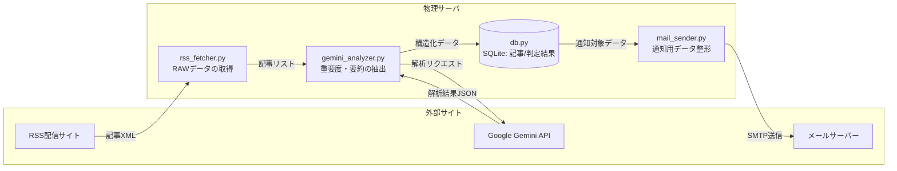

# IT News Auto-Collector & Delivery System

## 1. 概要
特定のITニュースサイトからRSSを自動取得し、Gemini APIによる要約および重要度判定を通じてニュースの取捨選択を自動化。抽出した重要情報をデータベースに蓄積し、メール通知までを一貫して行う自律型システム。

## 2. 特徴・主な機能
- **RSSフィードの自動取得**: 特定のITニュースサイトのRSSフィードを定期的に取得し、最新記事を自動収集する仕組みを構築。
- **Gemini APIによる記事分析**: 
	  - 複数の記事データをJSON形式に整形し、Gemini APIへ一括送信。記事ごとに以下の情報を自動生成する。また、重要度の閾値を設定することで、関心の高いニュースのみを抽出し、自分専用のニュースデータベースを構築可能。
			-記事データ要約（summary）
			-重要度スコア（importance）
			-評価理由（reason）
			-技術カテゴリ(category)
- **SQLiteでのデータ管理**: 取得した記事およびAI分析結果をSQLiteに保存し、以下を実現。
	-URLのユニーク制約による重複排除
	-最新記事を指定件数取得し、未分析記事のみを抽出（効率的なバッチ処理）
	-要約・スコア・理由・技術カテゴリの永続化
	-過去データを活用した重要ランキングの生成
- **メール通知機能**: 重要度が一定以上の記事を抽出し、Gmail経由で指定アドレスへ通知。記事の要約・スコア・URLを含む形式で配信し、効率的な情報収集を支援する。
- **完全自動運用**: cronを利用して定期実行を行い、「取得 → 分析 → 通知」までを完全自動化。24時間365日、人手を介さない運用を実現。
- **ログの監視**：　loggingモジュールを用いて処理状況を記録し、INFOレベル以上のログを監視。
	-処理成功／失敗の可視化
	-エラー発生時の迅速な原因特定
	-運用時のトラブルシューティング性向上

## 3.使用技術
- **Language**: Python 3.12
- **Libraries/Frameworks**: 
	-feedparser（RSS取得）
	-sqlite3（データベース管理）
	-google / google.genai（Gemini API連携）
	-logging（ログ管理）
	-dataclasses（データ構造定義）
	-python-dotenv（環境変数管理）
	-smtplib / email（メール送信）
- **Standard Libraries**:
	-json / os / pathlib / datetime
- **Infrastructure**:
    - **Self-Hosted Linux Server**: 自宅に構築した物理サーバー（WSL 2/Ubuntu）で運用
    - **Environment**: Python仮想環境（venv）を使用
    - **Task Scheduler**:cronによる定期実行（1日1回のバッチ処理およびデータメンテナンス）
    - **Hardware Context**: 
	    -Ryzen 7 / 64GB RAM 搭載のmini PCを24時間常時稼働
	    -将来的な並列処理や負荷増加を見据えた構成

## データフロー構成図

## モジュール構成図

## 4. こだわり・工夫した点

- **情報のノイズ除去と最適化**:  
 ただ記事を収集するだけでなく、Pandasを活用して重複を排除。さらに記事タイトルが短いデータを除外するフィルタリングを実装し、通知される情報の質にこだわりました。
- **メンテナンスフリーな運用設計**:  
 データベース（CSV）が際限なく肥大化するのを防ぐため、30日以上経過したデータを自動でパージ（削除）する機能を搭載。長期的な安定稼働を前提とした設計を行いました。
- **24時間稼働の「自分専用秘書」**:  
 cronとWSL2を組み合わせることで、IT関連ニュースの情報収集の完全な自動化を実現。ハイスペックなミニPCをサーバーとして活用し、インフラからアプリまで一貫して構築しました。
 - **メンテナンス性を意識したコード設計（モジュール化）**:  
  メール送信などの汎用的な機能は `my_utils.py` に分離し、共通関数として定義しました。これにより、メインのスクリプト（`it_news_selenium.py`）の見通しが良くなるだけでなく、将来別のツールを作る際にも機能を再利用できる「拡張性」を考慮した設計にしています。
- **環境変数の安全な管理**:  
  Gmailの認証情報などの機密情報をコードに直接書かず、`.env` ファイルと `python-dotenv` を使用して管理。セキュリティリスクを抑え、共同開発や公開を前提としたプラクティスを取り入れました。