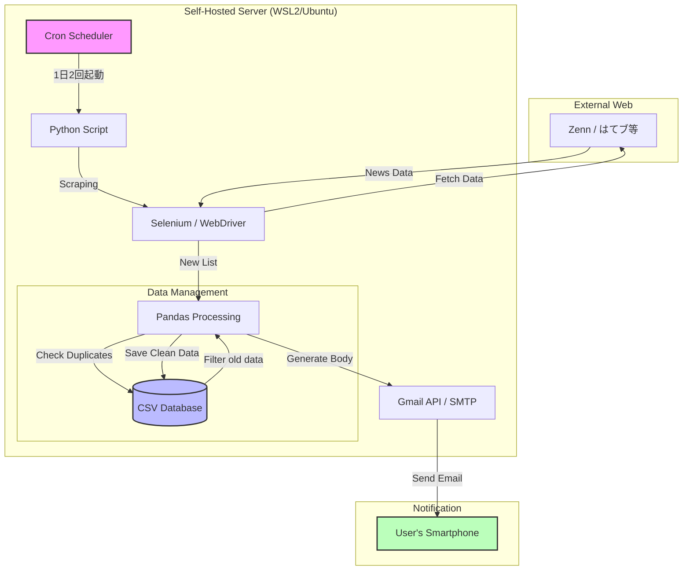

# IT News Auto-Collector & Delivery System

## 1. 概要
特定のITニュースサイト（Zenn, はてなブックマーク等）から最新記事を自動収集し、データのフィルタリング・蓄積・通知を行う自律型システム。

## 2. 特徴・主な機能
- **自動スクレイピング**: Seleniumを用いて、動的なWebサイトから最新のITニュースを抽出。
- **インテリジェント・データ管理**: 
    - Pandasを使用し、記事の重複削除や特定キーワードによるフィルタリングを実行。
    - **自動クリーンアップ**: 30日を経過した古いデータを自動削除し、ストレージを最適化。
- **プッシュ通知**: 厳選されたニュースを1日2回、Gmail経由で指定のアドレスへ送信。
- **完全自動運用**: cronを設定し、24時間365日の無人稼働を実現。

## 3. 使用技術 (Tech Stack)
- **Language**: Python 3.12
- **Libraries**: Selenium, Pandas, python-dotenv, smtplib
- **Infrastructure**:
    - **Self-Hosted Linux Server**: 自宅に構築した物理サーバー（WSL 2/Ubuntu）
    - **Environment**: Python Virtual Environment (venv)
    - **Task Scheduler**: cron (1日2回の定時実行とデータの自動メンテナンス)
    - **Hardware Context**: 高負荷なスクレイピングや並列処理を見据え、Ryzen 7 / 64GB RAM を搭載したminiPCを Linux サーバーとして 24時間常時稼働。

## 4. こだわり・工夫した点

- **情報のノイズ除去と最適化**:  
 ただ記事を収集するだけでなく、Pandasを活用して重複を排除。さらに記事タイトルが短いデータを除外するフィルタリングを実装し、通知される情報の質にこだわりました。
- **メンテナンスフリーな運用設計**:  
 データベース（CSV）が際限なく肥大化するのを防ぐため、30日以上経過したデータを自動でパージ（削除）する機能を搭載。長期的な安定稼働を前提とした設計を行いました。
- **24時間稼働の「自分専用秘書」**:  
 cronとWSL2を組み合わせることで、IT関連ニュースの情報収集の完全な自動化を実現。ハイスペックなミニPCをサーバーとして活用し、インフラからアプリまで一貫して構築しました。
 - **メンテナンス性を意識したコード設計（モジュール化）**:  
  メール送信などの汎用的な機能は `my_utils.py` に分離し、共通関数として定義しました。これにより、メインのスクリプト（`it_news_selenium.py`）の見通しが良くなるだけでなく、将来別のツールを作る際にも機能を再利用できる「拡張性」を考慮した設計にしています。
- **環境変数の安全な管理**:  
  Gmailの認証情報などの機密情報をコードに直接書かず、`.env` ファイルと `python-dotenv` を使用して管理。セキュリティリスクを抑え、共同開発や公開を前提としたプラクティスを取り入れました。