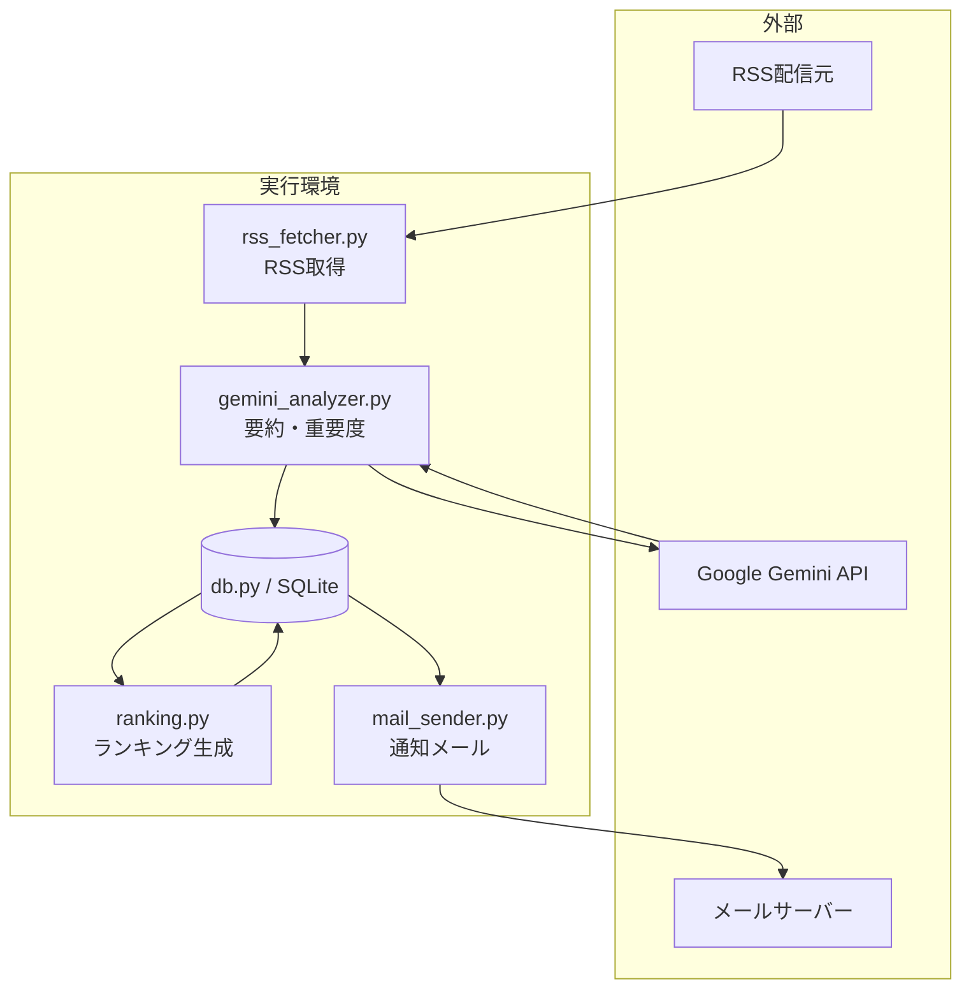
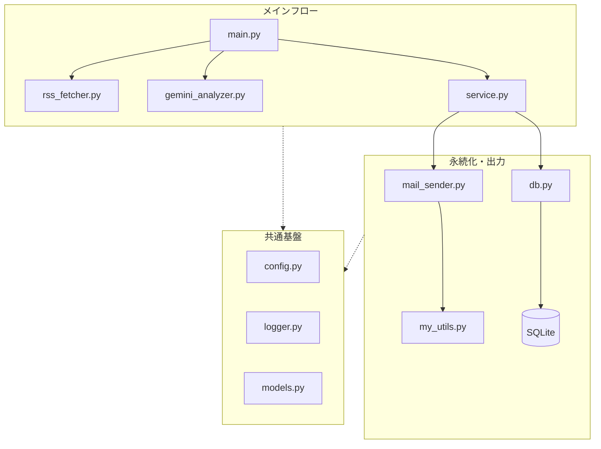

<div id="top"></div>

# IT News Auto-Collector & Delivery System

**Version 1.1** — レイヤード設計と依存注入を導入し、テスト性・保守性・拡張性を大幅に向上させたエンタープライズ志向の自律型バッチシステム


## 使用技術一覧

<p style="display: inline">
  
  
  
  
</p>

---

## 目次

1. [はじめに](#はじめに)
2. [プロジェクトについて](#プロジェクトについて)
3. [ビジネス上の価値](#ビジネス上の価値)
4. [v1.0 からの改善点](#v10-からの改善点v11)
5. [環境](#環境)
6. [アーキテクチャ](#アーキテクチャ)
7. [工夫した点・アピールポイント](#工夫した点アピールポイント)
8. [リポジトリ構成](#リポジトリ構成)
9. [セットアップと実行](#セットアップと実行)
10. [運用イメージ](#運用イメージ)
11. [今後の拡張例（v2.0 予定）](#今後の拡張例v20-予定)
12. [トラブルシューティング](#トラブルシューティング)
13. [ライセンス・連絡](#ライセンス連絡)

---

## はじめに

**バックエンド寄りの Python 製オートメーション**として公開しているポートフォリオ用リポジトリです。マネージドクラウドに縛られない **自ホストで完結する設計** と、**LLM を業務フローに組み込んだ処理** を示す目的でまとめています。

| 対象者 | 参照箇所 |
|--------|----------|
| **採用・発注担当** | [ビジネス上の価値](#ビジネス上の価値) → [v1.0 からの改善点](#v10-からの改善点v11) → [工夫した点・アピールポイント](#工夫した点アピールポイント) → [環境](#環境) |
| **クライアント（非エンジニア）** | [プロジェクトについて](#プロジェクトについて) → [ビジネス上の価値](#ビジネス上の価値) → [運用イメージ](#運用イメージ) |
| **開発者・共同作業者** | [リポジトリ構成](#リポジトリ構成) → [セットアップと実行](#セットアップと実行) → [トラブルシューティング](#トラブルシューティング) |

<p align="right">(<a href="#top">トップへ</a>)</p>

---

## プロジェクトについて

複数の IT ニュースソース（RSS）から記事を **自動取得** し、**Google Gemini API** で要約・重要度スコア・技術カテゴリの付与を行います。取得した記事を SQLite に蓄積し、**期間内トップ記事のランキング** を生成したうえで、しきい値を超えた記事のみ **Gmail（SMTP）で通知** します。人手による巡回と取捨選択を減らし、**「読むべき記事」が分かる状態** へ変換するパイプラインです。

<p align="right">(<a href="#top">トップへ</a>)</p>

---

## ビジネス上の価値

- **時間削減**: 毎日のニュースサイト巡回とユーザーの関心度が高い記事の取捨選択を自動化します。
- **意思決定の補助**: 記事の要約と重要度を数値化することで、キャッチアップの優先順位が付けやすくなります。
- **再現性**: 記事の選別ルールを設定することで、毎回同じ基準でスクリーニングが可能です。
- **運用しやすさ**: ログローテーション付きのファイルログ、環境変数による秘密情報の分離、モジュール分割による保守性を意識した構成です。

<p align="right">(<a href="#top">トップへ</a>)</p>

---

## v1.0 からの改善点（v1.1）

v1.0 で実装したコア機能に加え、以下の**設計・アーキテクチャ面の改善**により、実務に耐える保守性と拡張性を実現しました。

| 改善領域 | 内容 | 効果 |
|---------|------|------|
| **DB 層の整理** | `DatabaseManager` クラスの導入により、DB 操作を一元管理。テスト時のモック化が容易に。 | 依存性の明確化、単体テスト化の基盤 |
| **Service 層の導入** | ビジネスロジック（データ保存、通知対象抽出、フロー制御）を `service.py` に集約。 | 責務分離、ロジックの再利用性向上 |
| **Ranking 処理の分離** | ランキング生成ロジックを独立モジュール化。パラメータ変更が容易に。 | ロジック検証・テスト効率化 |
| **Mail 送信処理の整理** | テンプレート化、エラーハンドリングの強化。送信リトライ機能を追加。 | 通知信頼性向上、処理の可視化 |
| **依存注入パターン** | `DatabaseManager` をコンストラクタ引数で注入し、オブジェクト間の結合度を低減。 | テスト性向上、実装の柔軟性確保 |
| **コードのモジュール化** | 各モジュールの責務を明確に定義、層間の呼び出し規約を統一。 | 新機能追加時の影響範囲を最小化 |

これにより、**既存ロジックに影響を与えずに新しい通知チャネルを追加** したり、**リポジトリを PostgreSQL に切り替え** たりすることが可能になりました。

### Version History
```
v1.0  コア機能完成
      - RSS取得 / SQLite保存 / Geminiによるニュース評価
      - ランキング生成 / メール配信
 
v1.1  設計・アーキテクチャ改善
      - DatabaseManagerによるDB層の整理
      - service層の導入（ビジネスロジックの分離）
      - 依存注入パターンの導入
      - モジュール間の責務を明確化
 
v2.0  運用・拡張（予定）
      - FastAPIによるAPI化
      - Web UI / Docker対応
      - ユーザーごとのカスタマイズ配信
```


<p align="right">(<a href="#top">トップへ</a>)</p>

---

## 環境

**前提**: Python 3.12 以上が必要です。

| ライブラリ | バージョン | 用途 |
|-----------|-----------|------|
| Python | 3.12 | 実行環境 |
| feedparser | 6.0.12 | RSS取得・パース |
| requests | 2.32.5 | HTTP通信 |
| python-dotenv | 1.2.1 | 環境変数管理 |
| pydantic | 2.12.5 | データバリデーション・モデル定義 |
| google-genai | 1.62.0 | Gemini API クライアント |
| tenacity | 9.1.2 | リトライ処理 |
| tqdm | 4.67.3 | 進捗表示 |
| websockets | 16.0 | WebSocket通信 |
 
その他の標準ライブラリ（`sqlite3` / `smtplib` / `logging`）は Python 付属のため別途インストール不要です。

<p align="right">(<a href="#top">トップへ</a>)</p>

---

## アーキテクチャ

### データフロー



### モジュール構成（概念）



<p align="right">(<a href="#top">トップへ</a>)</p>

---

## 工夫した点・アピールポイント

### 1. レイヤード設計による責務分離

```
Presentation / API層
    ↓
Service層（ビジネスロジック）
    ↓
Data層（DB・永続化）
    ↓
Infrastructure層（外部API・ログ）
```

各層が独立した責務を持つため、**層単位でのテストが可能** になり、**機能追加時の影響範囲が限定** されます。

### 2. 依存注入による保守性向上

```python
# 依存をコンストラクタで受け取る
service = NewsService(database_manager=db)

# テスト時はモック化が容易
service = NewsService(database_manager=MockDatabase())
```

テストコード作成時に外部依存を除外でき、**単体テストのコスト削減** につながります。

### 3. バッチ処理の一元化

本システムの処理ステップ（取得→分析→ランキング→通知）を `service.py` で一括管理。エラーハンドリングとログの責務が明確で、本番運用での **トラブルシューティングが効率的** です。

### 4. スケーラブルな設計

リポジトリや通知チャネル、AI エンジンを差し替える際に、**既存コードへの影響なしに実装可能** な構造。以下のような拡張が想定されています：

- **リポジトリ層**: SQLite → PostgreSQL / MongoDB への切り替え
- **通知層**: Gmail → Slack / Discord への追加
- **AI層**: Gemini → ChatGPT / Claude への置き換え

### 5. 運用性を見据えた設計

- ログローテーション機能により、長期運用でのディスク管理が自動化
- 環境変数による設定分離で、デプロイ環境ごとの調整が容易
- `batch_id` によるデータ管理により、処理の追跡と再実行が可能

<p align="right">(<a href="#top">トップへ</a>)</p>

---

## リポジトリ構成

```
it-news-system/
├── README.md
├── requirements.txt      # 依存パッケージ一覧
├── src/
│   ├── main.py           # エントリポイント
│   ├── config.py         # パス・API・通知しきい値など
│   ├── rss_fetcher.py    # RSS取得
│   ├── gemini_analyzer.py
│   ├── ranking.py
│   ├── service.py        # 収集〜分析〜ランキングのオーケストレーション
│   ├── db.py
│   ├── mail_sender.py
│   ├── models.py
│   ├── my_utils.py       # SMTP送信ヘルパ
│   └── logger.py
├── data/                 # SQLite 等（.gitignore 推奨）
└── logs/                 # ログ出力先
```

<p align="right">(<a href="#top">トップへ</a>)</p>

---

## リポジトリ構成

## セットアップと実行

### 1. 仮想環境の作成とパッケージのインストール

```bash
python3.12 -m venv .venv
source .venv/bin/activate
pip install -r requirements.txt
```

### 2. 環境変数の設定

`.env` ファイルをプロジェクトルートに作成し、以下を設定してください。

```
GEMINI_API_KEY=your-gemini-api-key
GMAIL_USER=your-email@gmail.com
GMAIL_PASS=your-app-password
```

#### 環境変数一覧

| 変数名 | 役割 | 備考 |
|--------|------|------|
| `GEMINI_API_KEY` | Gemini API の認証キー | Google AI Studio で発行 |
| `GMAIL_USER` | 送信元 Gmail アドレス | |
| `GMAIL_PASS` | Gmail の SMTP 用パスワード | アプリパスワードを推奨（運用ポリシーに従ってください） |

#### 動作設定（config.py）

ユーザーが運用ポリシーに合わせて調整することが多い変数のみを抜粋しています。

| 変数名 | 役割 | デフォルト値の目安 |
|--------|------|-------------------|
| `IMPORTANCE_THRESHOLD` | メール通知する記事の重要度下限（1〜10） | 7 |
| `NOTIFICATION_LOOKBACK_DAYS` | 通知対象とする記事の取得期間（日） | 7 |
| `MAX_NOTIFICATION_COUNT` | 1回の通知で送る最大記事数 | 5 |

### 3. `data/` と `logs/` の用意

初回実行前に、リポジトリ直下にディレクトリを用意してください（`config.py` の `DB_PATH`・`LOG_FILE` がこの前提です）。

```bash
mkdir -p data logs
```

### 4. バッチ実行

リポジトリのルートをカレントにして実行します（`python` が `src/main.py` の所在を解決できるようにするため）。

```bash
python src/main.py
```

### 5. 定期実行（cron）の設定例

```
0 8 * * * cd /path/to/it-news-system && .venv/bin/python src/main.py
```

通知の強さは `config.py` の `IMPORTANCE_THRESHOLD`、`NOTIFICATION_LOOKBACK_DAYS`、`MAX_NOTIFICATION_COUNT` などで調整できます。

<p align="right">(<a href="#top">トップへ</a>)</p>

---

## 運用イメージ

1. 指定時刻にバッチが起動する。
2. RSSから新規記事を取り込み、未分析分をGeminiで処理する。
3. ランキングを更新し、通知条件を満たす記事があればメールを送る。
4. ログファイルで成功・失敗を追跡する。

<p align="right">(<a href="#top">トップへ</a>)</p>

---

## 今後の拡張例（v2.0 予定）

現在のモジュール設計により、以下の拡張が容易に実装できるように構成されています。

| 拡張内容 | 影響範囲 | 優先度 |
|---------|---------|--------|
| **Web UI の追加** | 新規レイヤー（FastAPI / Flask）。既存バッチロジックは影響なし | ★★★ |
| **記事本文取得** | `rss_fetcher.py` に Web スクレイピング処理を追加。Gemini の分析精度が向上 | ★★★ |
| **ユーザーごとのカスタマイズ配信** | `service.py` のフィルタロジックを拡張。DB スキーマに user_id を追加 | ★★☆ |
| **API 化** | 既存バッチ処理を REST エンドポイント化。外部システムとの連携が可能に | ★★☆ |
| **Slack / Discord 通知** | `mail_sender.py` と同じインターフェースで通知クラスを実装。既存コードへの影響なし | ★☆☆ |
| **PostgreSQL への移行** | `db.py` の実装を切り替えるだけで対応。Service 層以上は変更不要 | ★☆☆ |

<p align="right">(<a href="#top">トップへ</a>)</p>

---

## トラブルシューティング

### `data/` または `logs/` が無い

SQLite のパス（`data/news.db`）やログファイル（`logs/it_news_system.log`）はコード側でディレクトリを自動作成しません。**リポジトリ直下に `mkdir -p data logs` を用意**してから再実行してください。

### `.env` が読み込まれない／キーが空になる

- `.env` は **プロジェクトルート**（`README.md` と同じ階層）に置きます。`src/` 配下に置いていると読み込まれません。
- 変数名の typo（`GEMINI_API_KEY` など）と、値の前後に余分な引用符が無いか確認してください。[環境変数一覧](#環境変数一覧)を参照してください。

### `ModuleNotFoundError` 

READMEどおり **リポジトリルートで** `python src/main.py` を実行してください。別ディレクトリで `python main.py` を実行すると、`src` 内のモジュール実行に失敗することがあります。

### RSS が取得できない・件数が常に少ない

- **ネットワーク**（プロキシ・FW）と RSS URL の生存を確認してください。
- フィード側の障害やレート制限の際は、時間を置いて再実行するか、`config.py` / `rss_fetcher` 側の取得ロジック・タイムアウト設定を見直してください。

### Gemini API からエラーが返る

- `GEMINI_API_KEY` が有効か、Google AI Studio／課金・**クォータ**に達していないか確認してください。
- **429（レート制限）** の場合は間隔を空けて再実行するか、1 バッチあたりの記事数（`FETCH_LIMIT` など）を下げて負荷を抑えます。
- モデル ID（`config.py` の `MODEL_ID`）が利用可能な一覧と一致しているか確認してください。

### Gemini の戻りが JSON として解釈できない

プロンプトとモデルの出力がずれると解析に失敗することがあります。ログで該当記事を特定し、**温度 (`TEMPERATURE`) を下げる**、プロンプトで「JSON のみ」と指定する、**失敗時はスキップする** など運用面でカバーする想定です（必要に応じて `gemini_analyzer` のエラーハンドリングを強化）。

### `database is locked`（SQLite）

同一マシンで**別プロセスが同じ `news.db` を開いている**、またはディスク／NFS の遅延でロックが残っている場合に起こります。他プロセスを止めてから再実行するか、時間を空けてから再試行してください。

### メールが届かない

- `GMAIL_USER` / `GMAIL_PASS` が正しいか確認してください。
- Gmail は **アプリパスワード** を使うのが一般的です（2 段階認証と組み合わせ）。通常のログインパスワードでは SMTP 認証に失敗します。
- `config.py` の **`IMPORTANCE_THRESHOLD` の値が高すぎて通知候補が 0 件**になっていないか確認してください。
- 迷惑メールフォルダや、送信元・送信先の同一アドレスによるフィルタも確認してください。

### cron で動かない・ログに何も残らない

- 実行ファイルや仮想環境のPythonを指定する際は、**フルパス**で指定してください（例:`.venv/bin/python`,`/path/to/it-news-system`）。

### ログの確認方法

`logs/` 以下にローテーション付きログ（`it_news_system.log` ）が出力されます。**異常時はこのファイル**を確認し、スタックトレースと直前の INFO を突き合わせてください。

<p align="right">(<a href="#top">トップへ</a>)</p>

---

## ライセンス・連絡

リポジトリにライセンスファイルを置く場合は、そのファイルに従ってください。案件相談・ポートフォリオに関する連絡は、プロフィールに記載の連絡先までお願いします。