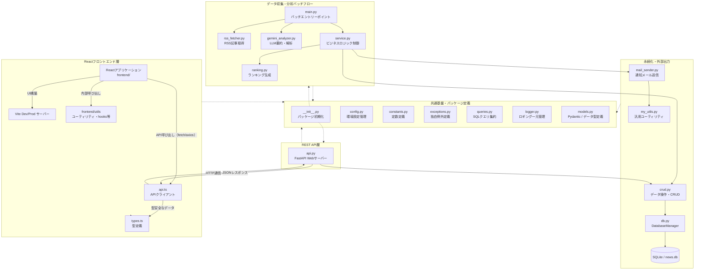

<div id="top"></div>

# IT News Auto-Collector & Delivery System

**Version 1.5.1** — バックエンドを `backend/src/` へ、Dockerfile を `docker/` へ再配置し、フロントエンドとバックエンドのディレクトリ分離を明確化。ローカル／コンテナ双方でプロジェクトルートを正しく解決するようパス解決を調整。

<p style="display: inline">
  
  
  
  
  
  
  
  
  
</p>

---

## 目次

1. [プロジェクト概要](#プロジェクト概要)
2. [Tech Stack](#tech-stack)
3. [アーキテクチャ](#アーキテクチャ)
4. [バージョン履歴](#バージョン履歴)
5. [セットアップ](#セットアップ)
6. [リポジトリ構成](#リポジトリ構成)
7. [Highlights](#highlights)


---

---

## プロジェクト概要

### システム概要

ITニュース記事を自動収集し、Google Gemini APIを利用して記事の要約・重要度スコアリングを行うニュース収集システムです。

収集した記事はREST APIおよびWeb UIを通じて提供し、重要度の高いITニュースを効率的に閲覧できる環境を構築しています。

ユーザーごとの関心トピックや「いいね」などのフィードバック情報を活用したパーソナライズ機能にも対応し、個人に最適化されたニュース配信を目指しています。

### 主な機能

- **RSS取得**: 複数のニュースソースからRSSフィードを取得し、記事を自動収集
- **AI分析**: Google Gemini APIを使用して記事の要約・重要度スコアリングを実施
- **ランキング生成**: AI分析結果をもとに記事の重要度ランキングを生成
- **メール通知**: 重要度の高い記事をメールで通知
- **パーソナライズ基盤**: ユーザーの関心トピックや「いいね」情報を保存し、推薦機能に利用可能なデータを管理
- **REST API**: FastAPIによるAPIを提供し、ニュース・ユーザー情報・フィードバック情報を管理
- **フロントエンド**: React + TypeScript + ViteによるWeb UIを提供


<p align="right">(<a href="#top">トップへ</a>)</p>

---


## Tech Stack

| 分類        | 技術                      |
| --------- | ----------------------- |
| Backend   | FastAPI, Python 3.12    |
| Frontend  | React, TypeScript, Vite |
| Database  | SQLite                  |
| AI        | Google Gemini API       |
| Container | Docker, Docker Compose  |

| コンポーネント        | バージョン          |
| -------------- | -------------- |
| Docker Engine  | v25.0+         |
| Docker Compose | v2.0+          |
| Python         | 3.12 (Docker内) |


<p align="right">(<a href="#top">トップへ</a>)</p>

---


## バージョン履歴

### Version History

```
v1.0.0  コア機能完成

v1.1.0  設計・アーキテクチャ改善

v1.1.1  堅牢性の向上・リファクタリング

v1.2.0  REST API化

v1.2.1  ランキングアルゴリズムの改善・公開日時の正規化

v1.3.0  Dockerコンテナ化

v1.3.1  サービス信頼性の強化

v1.3.2  マルチソース収集とパーソナライズ基盤の構築

v1.4.0  パーソナライズAPIの実装とDB基盤の堅牢化

v1.5.0  Reactフロントエンドの導入

v1.5.1  ディレクトリ構成の整理（backend / docker）
```

### Roadmap

```
v1.6.0  パーソナライズUI・API連携
         - 興味分野設定UI
         - いいね機能
         - パーソナライズAPIとの連携

v1.7.0  おすすめ機能
         - おすすめスコアの算出
         - 興味分野・いいね履歴を利用した表示順の最適化

v1.8.0  ニュース閲覧機能の強化
         - お気に入り機能
         - 既読管理
         - UI/UXの改善

v2.0.0  ユーザー認証・運用強化
         - JWT認証
         - マイページ
         - Slack / Discord通知
         - 非同期処理（async/await）
```

<p align="right">(<a href="#top">トップへ</a>)</p>

---


## アーキテクチャ

### データフロー

```mermaid
flowchart LR
    subgraph ext["外部システム"]
        Web[RSS配信元]
        GeminiAPI[Google Gemini API]
        SMTP[メールサーバー]
        Client[API クライアント]
        FE[フロントエンド (React)]
    end

    subgraph dc["Docker Compose"]
        subgraph api["api サービス（常時起動）"]
            apiMod[api.py<br/>FastAPI REST API]
        end
        subgraph worker["worker サービス（オンデマンド）"]
            fetch[rss_fetcher.py<br/>RSS記事収集]
            service[service.py<br/>ビジネスロジック制御]
            analyze[gemini_analyzer.py<br/>LLM解析・スコアリング]
            rank[ranking.py<br/>ランキングロジック]
            notify[mail_sender.py<br/>メール配信]
        end
        subgraph frontend["frontend<br/>(React + Vite)"]
            ReactApp[Reactアプリケーション<br/>Vite Dev/prodサーバー]
        end
    end

    subgraph ds["データストア"]
        storage[(db.py / SQLite<br/>data/news.db)]
        crudMod[crud.py<br/>データ操作・CRUD]
    end

    Web -->|RSSフィードXML| fetch
    fetch -->|未処理記事| service
    service <-->|プロンプト / 構造化出力| GeminiAPI
    service -.->|解析依頼| analyze
    service -.->|ランキング集計| rank
    service -->|記事・分析結果・順位操作| crudMod
    crudMod -->|SQL実行| storage
    storage -->|データ参照| crudMod
    crudMod -->|業務データ| service
    service -->|通知対象データ| notify
    notify -->|SMTPプロトコル| SMTP

    %% Reactフロントエンドとの連携
    FE -- HTTP(S)/Fetch/axiosなど -->|API呼び出し| ReactApp
    ReactApp -- HTTP(S) (fetch/axios) -->|ユーザー操作・表示・更新| apiMod
    apiMod -->|JSON レスポンス| ReactApp
    ReactApp -->|動的UI, ユーザーイベント| FE

    %% 既存APIクライアントもAPIサーバーへ
    Client -->|HTTP リクエスト| apiMod

    apiMod -->|CRUD操作| crudMod
    crudMod -->|型安全なデータ / Pydanticモデル| apiMod
    apiMod -->|JSON レスポンス| Client

    analyze ~~~ rank

```

### モジュール構成（概念）


```mermaid
flowchart TD
    subgraph Core [データ収集・分析バッチフロー]
        Main[main.py<br/>バッチエントリーポイント]
        RSS[rss_fetcher.py<br/>RSS記事取得]
        AI[gemini_analyzer.py<br/>LLM要約・解析]
        Rank[ranking.py<br/>ランキング生成]
        Service[service.py<br/>ビジネスロジック制御]
    end

    subgraph API [REST API層]
        FastAPI[api.py<br/>FastAPI Webサーバー]
    end

    subgraph Output [永続化・外部出力]
        Mail[mail_sender.py<br/>通知メール送信]
        Utils[my_utils.py<br/>汎用ユーティリティ]
        CRUD[crud.py<br/>データ操作・CRUD]
        DB[db.py<br/>DatabaseManager]
        SQLite[(SQLite / news.db)]
    end

    subgraph Infra [共通基盤・パッケージ定義]
        Init["__init__.py<br/>パッケージ初期化"]
        Config[config.py<br/>環境設定管理]
        Const[constants.py<br/>定数定義]
        Exc[exceptions.py<br/>独自例外定義]
        Queries[queries.py<br/>SQLクエリ集約]
        Logger[logger.py<br/>ロギング一元管理]
        Models[models.py<br/>Pydantic / データ型定義]
    end

    subgraph Frontend [Reactフロントエンド層]
        ReactApp[Reactアプリケーション<br/>frontend/]
        Vite[Vite Dev/Prod サーバー]
        Types[types.ts<br/>型定義]
        APIClient[api.ts<br/>APIクライアント]
        FEUtils[frontend/utils<br/>ユーティリティ・hooks等]
    end

    Main --> RSS
    Main --> AI
    Main --> Service
    Service --> Rank
    Service --> CRUD
    Service --> Mail
    Mail --> Utils
    FastAPI --> CRUD
    CRUD --> DB
    DB --> SQLite

    %% Reactフロントエンドとの連携
    ReactApp -->|API呼び出し（fetch/axios）| APIClient
    APIClient -->|HTTP通信| FastAPI
    FastAPI -->|JSONレスポンス| APIClient
    APIClient -->|型安全なデータ| Types
    ReactApp -->|内部呼び出し| FEUtils
    ReactApp -->|UI構築| Vite

    Core -.-> Infra
    API -.-> Infra
    Output -.-> Infra
    Frontend -.-> Types
    Frontend -.-> Infra
    Init -.-> Core
    Init -.-> API
```

<p align="right">(<a href="#top">トップへ</a>)</p>

---


---

## セットアップ

本システムは **Docker (Compose v2)** を用いたコンテナ環境に完全対応しています。ホストマシンの Python 環境を汚染することなく、依存パッケージのビルドからサーバーの起動までを 1 コマンドで完結できます。

### 1. 前提条件 (Prerequisites)

- Docker Engine (v25.0 以上推奨)
- Docker Compose (v2.0 以上)
- Google Gemini API キー ([Google AI Studio](https://aistudio.google.com/) より取得)

### 2. 環境変数の配置

リポジトリルートに `.env` ファイルを配置し、必要な認証情報を記述します。コンテナ起動時に自動的に読み込まれます。

```env
GEMINI_API_KEY=your_api_key_here
GMAIL_USER=your_email@gmail.com
GMAIL_PASS=your_app_password_here
```

### 3. コンテナのビルドと起動

プロジェクトのルートディレクトリで以下のコマンドを実行します。

```bash
# コンテナのビルドおよびバックグラウンド起動
docker compose up -d
```

起動後、自動的に API サーバーが立ち上がります。

- **接続確認**: [http://localhost:8080/](http://localhost:8080/) へアクセス
- **インタラクティブ API ドキュメント (Swagger UI)**: [http://localhost:8080/docs](http://localhost:8080/docs) へアクセス


### 4.動作および死活監視の確認

```bash
# STATUSに 「Up X minutes (healthy)」 と刻まれていれば正常にヘルスチェックが回っています
docker compose ps
```

<p align="right">(<a href="#top">トップへ</a>)</p>

---


## リポジトリ構成

```
it-news-system/
├── README.md
├── CHANGELOG.md
├── docker/
│   └── Dockerfile          # コンテナイメージ定義
├── compose.yaml            # Docker Compose サービス定義
├── requirements.txt
├── frontend/               # フロントエンド (React + TypeScript + Vite)
├── docs/                   # ドキュメント
├── backend/
│   └── src/
│       ├── main.py             # エントリポイント（バッチ処理）
│       ├── __init__.py         # パッケージ初期化
│       ├── api.py              # FastAPI サーバー・エンドポイント定義
│       ├── service.py          # 収集〜分析〜ランキングのオーケストレーション
│       ├── ranking.py          # ランキング生成ロジック
│       ├── gemini_analyzer.py  # Gemini API による AI 分析
│       ├── rss_fetcher.py      # RSS 取得
│       ├── db.py               # DB接続管理・スキーマ定義・バッチ処理
│       ├── crud.py             # データ操作（CRUD）ロジック(★v1.4.0)
│       ├── mail_sender.py      # メール送信処理
│       ├── models.py           # Pydantic・データモデル定義
│       ├── config.py           # パス・API・通知しきい値など
│       ├── constants.py        # アプリケーション定数定義
│       ├── exceptions.py       # カスタム例外定義
│       ├── queries.py          # データベースクエリ定義
│       ├── logger.py
│       └── my_utils.py         # SMTP 送信ヘルパ
├── data/                   # SQLite（ホストボリュームとしてマウント）
│   └── news.db
└── logs/                   # ログ出力先（ホストボリュームとしてマウント）
    └── it_news_system.log
```

<p align="right">(<a href="#top">トップへ</a>)</p>

---


## Highlights

### 1. レイヤードアーキテクチャ
API / Service / Data / Infrastructureを分離し、既存バッチ処理に影響を与えずFastAPIを統合

### 2. 堅牢性とデータ保護
UNIQUE制約・外部キー制約・リトライ処理により、マルチソース化に伴うデータ不整合やAPI障害時の停止を防止

### 3. LLMによるパーソナライズ分析
Geminiによる要約・重要度評価と鮮度減衰モデルで、関心度と鮮度を両立したランキングを算出

### 4. React × FastAPIによるWebアプリケーション
React / TypeScriptのUIからランキング閲覧・いいね操作・ユーザー設定をリアルタイムに実装

### 5. Dockerによる自動運用基盤
API / Workerのライフサイクル分離とホストcron連携で、手動運用なしの自律的な定期実行を実現