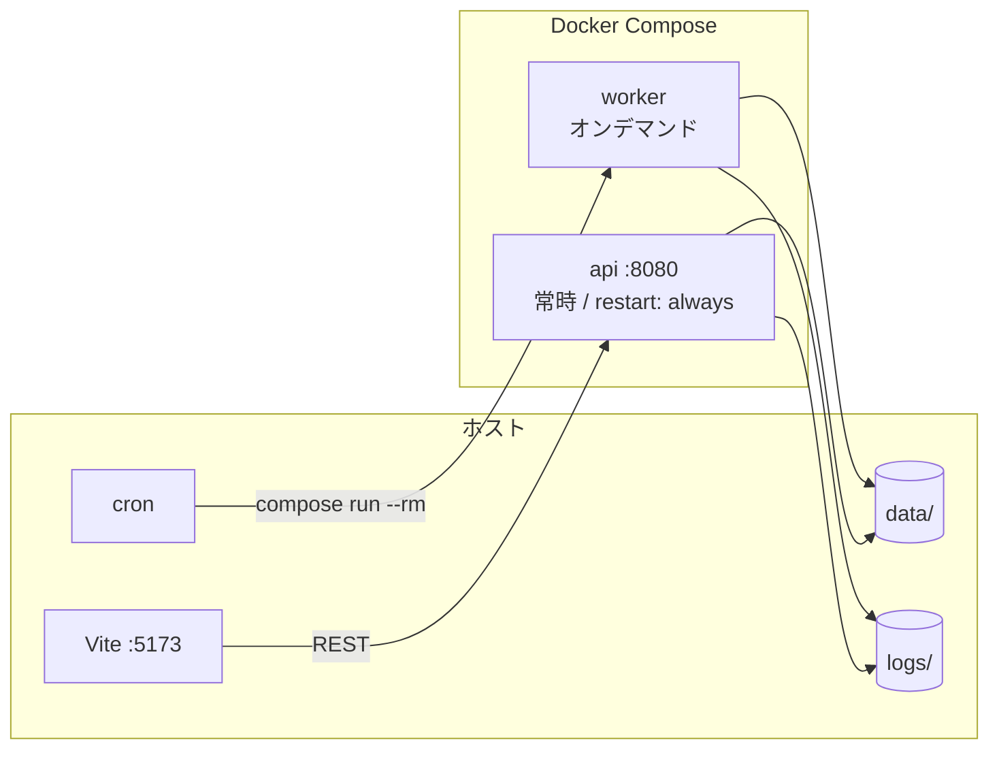
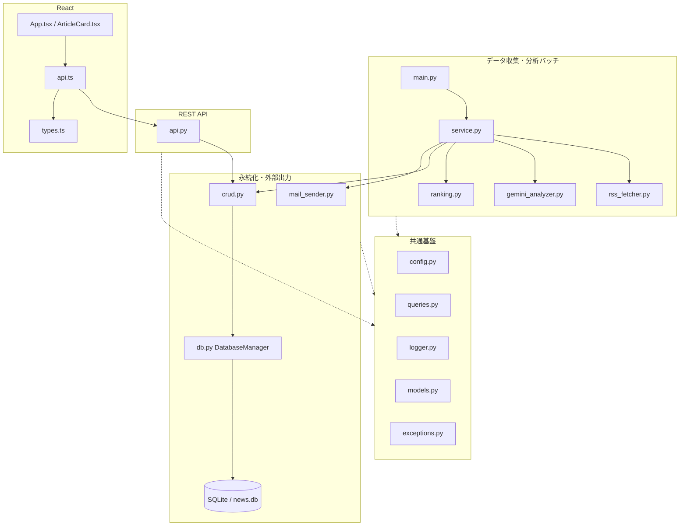
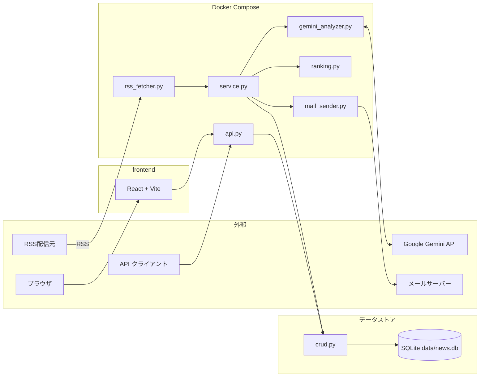
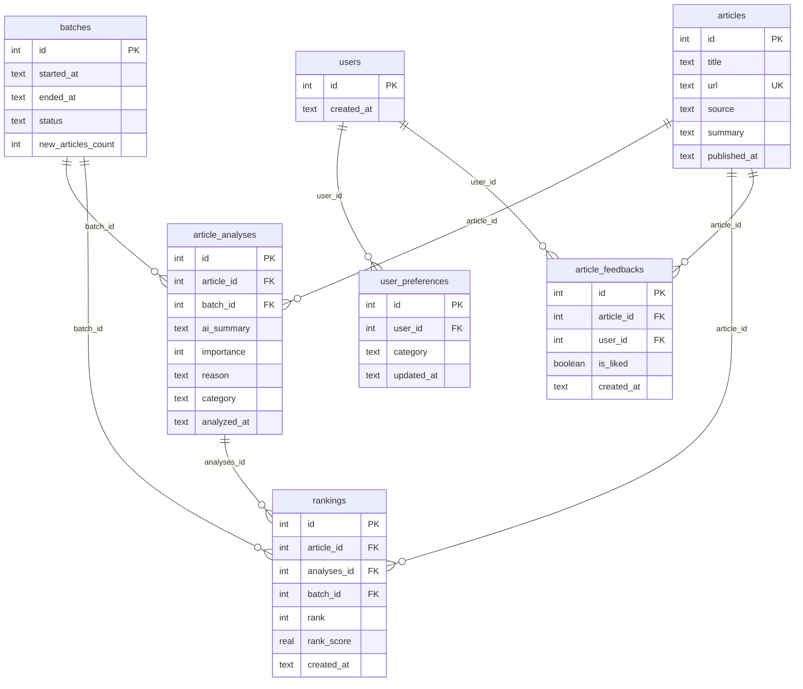

# アーキテクチャ

IT ニュースを **収集 → 分析 → ランキング → API / メール** で届けるシステムの設計正本です。個別の数値は [configuration.md](configuration.md)、バッチの起動・監視は [worker.md](worker.md) を正とします。

---

## 目次

1. [システム概要](#1-システム概要)
2. [実行トポロジ](#2-実行トポロジ)
3. [レイヤーとモジュール](#3-レイヤーとモジュール)
4. [データフロー](#4-データフロー)
5. [データモデル](#5-データモデル)
6. [ランキング設計](#6-ランキング設計)
7. [REST API 契約](#7-rest-api-契約)
8. [フロントエンド連携](#8-フロントエンド連携)
9. [Dockerfile 設計](#9-dockerfile-設計)

---

## 1. システム概要

複数 RSS から記事を集め、Google Gemini で要約・重要度を付け、鮮度を加味したランキングを SQLite に保存します。常時起動の FastAPI と React UI から閲覧し、しきい値を超えた記事はメールでも通知します。

- **レイヤー分離**: API / Service / Data / Infra を分け、バッチと REST が同じデータ層を共有する
- **データ保護**: `articles.url` の UNIQUE、`(article_id, batch_id)` の UNIQUE、外部キー、Gemini 失敗時のダミー分析
- **ランキング**: 重要度 × 鮮度減衰。同点は公開日時 → 記事 ID
- **実行基盤**: 同一イメージから `api`（常時）と `worker`（都度）を起動する

---

<a id="2-実行トポロジ"></a>
## 2. 実行トポロジ

Docker Compose は 2 サービスです。起動コマンドと cron は [worker.md](worker.md) を参照してください。

| サービス | 役割 | 起動 |
|---------|------|------|
| `api` | FastAPI を常時起動。`restart: always` と `GET /health` の healthcheck（30 秒間隔） | `docker compose up -d` |
| `worker` | RSS → 分析 → ランキング → メールを 1 バッチで実行して終了。`profiles: ["manual"]` のため `up -d` では起動しない | `docker compose run --rm worker` |

両サービスは `./data` と `./logs` をホストにマウントします。worker が更新した SQLite を api がそのまま参照します。フロントエンドは Compose 外の Vite 開発サーバーです。



---

<a id="3-レイヤーとモジュール"></a>
## 3. レイヤーとモジュール

バックエンドは `backend/src/`、フロントエンドは `frontend/src/` です。定数の意味は [configuration.md](configuration.md) を参照してください。

| 層 | 責務 | 主なモジュール |
|----|------|----------------|
| API | HTTP 契約、CORS、リクエスト検証 | [backend/src/api.py](../backend/src/api.py) |
| Service | 収集〜分析〜ランキング〜通知対象のオーケストレーション | [backend/src/service.py](../backend/src/service.py)、`rss_fetcher.py`、`gemini_analyzer.py`、`ranking.py`、`mail_sender.py` |
| Data | 接続・DDL・バッチ開始終了と CRUD | [backend/src/db.py](../backend/src/db.py)、[backend/src/crud.py](../backend/src/crud.py)、[backend/src/queries.py](../backend/src/queries.py) |
| Infra | 設定、ログ、例外、定数、型 | [backend/src/config.py](../backend/src/config.py)、`logger.py`、`exceptions.py`、`constants.py`、`models.py` |
| Frontend | 画面、型、API クライアント | [frontend/src/](../frontend/src/)（`App.tsx` / `ArticleCard.tsx` / `api.ts` / `types.ts`） |

`DatabaseManager` は接続・DDL・`start_new_batch` / `finish_batch` に限定し、記事・分析・ランキング・設定・フィードバックの操作は `crud.py` に集約します。



---

<a id="4-データフロー"></a>
## 4. データフロー

バッチと API は同じ SQLite を共有しますが、起動ライフサイクルは独立です。バッチ手順の詳細は [worker.md](worker.md) を参照してください。

### バッチ（worker）

1. `validate_config`
2. `start_new_batch` → `batch_id`
3. ソースごとに RSS 取得（1 ソース失敗はスキップ）し、記事を集約
4. Gemini 分析 → ランキング生成
5. 通知対象抽出 → メール
6. `finally` で `finish_batch`（`success` / `failed`）

分析プロンプトの全文は [configuration.md](configuration.md#5-gemini) にあります。

### API / UI

React は `GET /v1/rankings` で一覧を表示し、いいねは `POST /v1/articles/{id}/like` です。関心トピック API は実装済みで、UI 連携は Roadmap です。



---

<a id="5-データモデル"></a>
## 5. データモデル

SQLite ファイルは `data/news.db` です。パスは [configuration.md](configuration.md#2-パス解決) を参照してください。接続時に `PRAGMA foreign_keys = ON` を有効化し、未作成テーブルは起動時 DDL で作ります。

| テーブル | 役割 | 主な制約 |
|----------|------|----------|
| `batches` | バッチ実行単位 | PK `id`。`status` は `running` / `success` / `failed` |
| `articles` | 収集記事 | `url` UNIQUE |
| `article_analyses` | バッチごとの Gemini 分析 | FK `article_id` / `batch_id`、`(article_id, batch_id)` UNIQUE |
| `rankings` | バッチごとの順位 | FK `article_id` / `analyses_id` / `batch_id`。`rank_score` NOT NULL |
| `users` | ユーザー | PK `id`（クライアント指定。未登録時は `ENSURE_USER` で作成） |
| `user_preferences` | 関心カテゴリ | FK `user_id` |
| `article_feedbacks` | いいね | FK `article_id` / `user_id` |



公開日時は RSS の RFC 822 / ISO 8601 を正規化し、`YYYY-MM-DD HH:MM:SS` で保存します。パース失敗時は現在時刻にフォールバックします。

---

<a id="6-ランキング設計"></a>
## 6. ランキング設計

バッチ内のランキングは次の式です。係数の値は [configuration.md](configuration.md#4-スコアリング通知) の `FRESHNESS_TABLE` を正とします。

```
rank_score = importance × freshness(経過日数)
```

- `importance` は Gemini が付けた 1〜10（分析失敗のダミーは 0）
- `freshness` は公開日時からの経過日数で減衰する
- 対象は直近 `NOTIFICATION_LOOKBACK_DAYS` 日・`IMPORTANCE_THRESHOLD` 以上
- 各記事は最新の分析行（`MAX(article_analyses.id)`）を使う
- 同点は `published_at` 降順 → `article_id` 降順
- 上位 `RANKING_LIMIT` 件を現在の `batch_id` に保存する

生成 SQL（`GET_RANKED_ARTICLES_DYNAMIC`）は経過日数の区間に応じた `CASE` で減衰を適用します。0〜6 日は `FRESHNESS_TABLE` と同じ係数、7 日以上は `0.00` です。

API の `GET /v1/rankings` はスコアを再計算せず、保存済み `rankings` を `rank` 昇順で返します。

---

<a id="7-rest-api-契約"></a>
## 7. REST API 契約

ベース URL は `http://localhost:8080` です。クエリのデフォルト値と CORS オリジンは [configuration.md](configuration.md#8-fastapi-のチューニング値) を参照してください。対話確認は `GET /docs`（Swagger UI）です。

| メソッド | パス | 概要 |
|----------|------|------|
| GET | `/` | 生存確認 |
| GET | `/health` | Compose healthcheck 用 |
| GET | `/v1/rankings` | 指定バッチのランキング一覧 |
| GET | `/v1/categories` | UI 用カテゴリ一覧 |
| POST | `/v1/users/preferences` | 関心トピックの一括保存 |
| POST | `/v1/articles/{article_id}/like` | いいねの保存 |
| GET | `/docs` | Swagger UI |

通知メール用の抽出はバッチ内の CRUD（`GET_NOTIFICATION_TARGETS`）で行い、専用の通知 API は提供していません。

### GET /

```json
{ "status": "online", "message": "API is connected to SQLite" }
```

### GET /health

```json
{ "status": "healthy" }
```

### GET /v1/rankings

| クエリ | 型 | デフォルト | 意味 |
|--------|-----|------------|------|
| `limit` | int | `10` | 返却件数 |
| `min_importance` | int | `7` | 重要度の下限 |
| `batch_id` | int \| 省略 | 省略時は `rankings` の最新 `batch_id` | 対象バッチ |
| `lookback_days` | int | `7` | 公開日のさかのぼり日数 |

`batch_id` 未指定かつランキングが無い場合、およびフィルタ不一致の場合は **404 ではなく** 空結果です。

```json
{
  "total_count": 0,
  "rankedresponses": []
}
```

ヒット時の各要素（`RankedArticleResponse`）:

| フィールド | 型 | 説明 |
|------------|-----|------|
| `id` | int | 記事 ID |
| `title` | string | タイトル |
| `url` | string | 原文 URL |
| `source` | string | RSS ソース名 |
| `ai_summary` | string \| null | Gemini 要約 |
| `importance` | int \| null | 重要度 |
| `category` | string \| null | カテゴリ |
| `rank` | int \| null | バッチ内順位 |
| `rank_score` | float \| null | ランキングスコア |
| `published_at` | string \| null | 公開日時 |

DB エラーなど想定外は `500` です。

### GET /v1/categories

固定の文字列配列を返します。

```json
[
  "AI・LLM",
  "Cloud・Infrastructure",
  "CyberSecurity",
  "Webフロントエンド",
  "バックエンド・DevOps",
  "モバイルアプリ開発"
]
```

### POST /v1/users/preferences

未登録ユーザーは `ENSURE_USER` で作成し、既存の関心トピックを削除してから挿入します。

リクエスト:

```json
{ "user_id": 1, "categories": ["AI・LLM", "バックエンド・DevOps"] }
```

レスポンス:

```json
{ "status": "success", "message": "User 1's preferences updated successfully." }
```

### POST /v1/articles/{article_id}/like

パスの `article_id` とボディの `user_id` / `is_liked` を保存します。

リクエスト:

```json
{ "user_id": 1, "is_liked": true }
```

レスポンス:

```json
{ "status": "success", "message": "Article 12 has been liked by user 1." }
```

---

<a id="8-フロントエンド連携"></a>
## 8. フロントエンド連携

Vite 開発サーバー（既定 `:5173`）から FastAPI（`:8080`）へブラウザが直接 fetch します。接続先 URL は [configuration.md](configuration.md#10-フロントの接続先) の `API_BASE_URL`、許可オリジンは同ドキュメントの CORS 設定です。

| 画面 / モジュール | 呼び出す API |
|-------------------|--------------|
| `App.tsx` | `GET /v1/rankings` |
| `ArticleCard.tsx` | `POST /v1/articles/{id}/like`（楽観的更新、失敗時ロールバック。ユーザー ID は `1` 固定） |
| `api.ts` | 上記に加え `POST /v1/users/preferences` クライアント（UI 未接続） |

オリジンが CORS 許可リストに無いとブラウザが応答を捨てます。許可文字列を変えるときは [configuration.md](configuration.md) と `api.py` を合わせて更新してください。

---

## 9. Dockerfile 設計

`docker/Dockerfile` は Python 3.12 slim の単一イメージです。デフォルト CMD は API 起動で、Compose の `worker` だけ `python src/main.py` に上書きします。同一イメージにする理由は、バッチと API が同じコード・同じ `data/` を共有するためです。

| ステップ | 内容 | 意図 |
|---------|------|------|
| ベースイメージ | `python:3.12-slim` | 最小限の Python 3.12 |
| システム依存 | `curl` | Compose healthcheck が `GET /health` を叩くため |
| 環境変数 | `PYTHONDONTWRITEBYTECODE=1` | `.pyc` を作らない |
| 環境変数 | `PYTHONUNBUFFERED=1` | コンテナログへ即時出力 |
| 環境変数 | `PYTHONPATH=/app` | `src.*` の絶対インポートを固定 |
| システム依存 | `build-essential` | ネイティブ拡張のビルドに備える |
| 依存インストール | `requirements.txt` を先に COPY | ソース変更時のレイヤーキャッシュ |
| ソース配置 | `COPY backend/src/ ./src` | コンテナ内は `/app/src/` |
| ディレクトリ確保 | `mkdir -p data logs` | マウント前でもパスが存在する |
| ポート | `EXPOSE 8080` | API 待受の明示 |
| デフォルト CMD | `fastapi run src/api.py --port 8080 --host 0.0.0.0` | 単体起動時は API。Compose で上書き可 |
