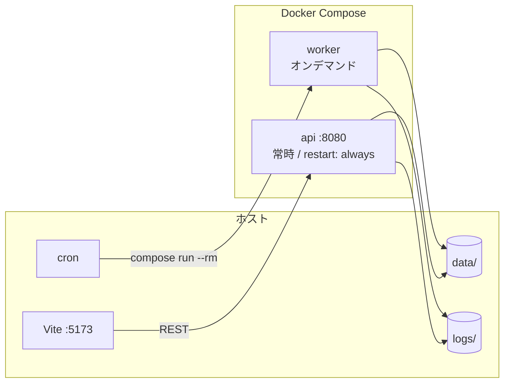
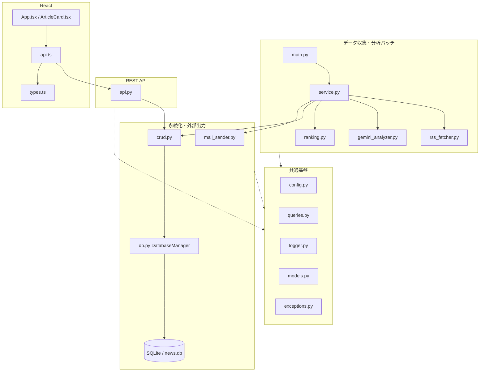
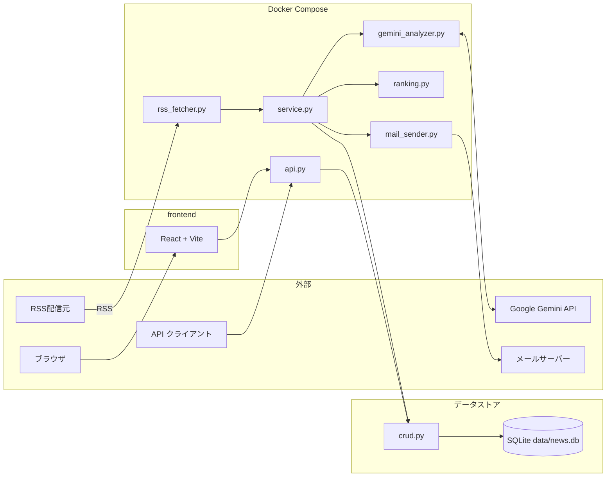

# アーキテクチャ

IT ニュースを **収集 → 分析 → ランキング → API / メール** で届けるシステムの設計正本です。個別の数値は [configuration.md](configuration.md)、バッチの起動・監視は [worker.md](worker.md) を正とします。

---

## 目次

1. [システム概要](#1-システム概要)
2. [コンテナ構成とサービス全体像](#2-コンテナ構成とサービス全体像)
3. [各レイヤーの役割と対応モジュール](#3-各レイヤーの役割と対応モジュール)
4. [ITニュース配信システムのデータフロー](#4-ITニュース配信システムのデータフロー)
5. [DBのデータモデル (SQLite)](#5-DBのデータモデル-SQLite)
6. [ランキング設計](#6-ランキング設計)
7. [REST API 契約](#7-rest-api-契約)
8. [フロントエンド連携](#8-フロントエンド連携)
9. [Dockerfile 設計](#9-dockerfile-設計)

---

## 1. システム概要

複数 RSS から記事を集め、Google Gemini で要約・重要度を付け、鮮度を加味したランキングを SQLite に保存します。常時起動の FastAPI と React UI から閲覧し、しきい値を超えた記事はメールでも通知します。

### 本システムの特徴

- **レイヤー分離**:
  バッチ処理（worker）と REST API（api）で「API / Service / Data / Infra」の層を明確に分離しており、それぞれのモジュールは単一責任で疎結合に設計されており、データ層（DBやCRUD操作）は双方から共通利用されます。このような構成により、拡張性・メンテナンス性や異なる実行基盤間の一貫性を確保しています。

- **データ保護**:
  記事URL（`articles.url`）のユニーク制約や `article_id` x `batch_id` の複合ユニーク制約、外部キー制約を設けることで重複登録や不整合データを防止し、リレーション管理を厳格化しています。
  また、Gemini の分析失敗時もダミー分析を記録することで処理と履歴の整合性を維持しています。

- **ランキング**:  
  Gemini で付与した記事の「重要度」と「公開からの鮮度」を掛け合わせた独自アルゴリズムで順位を決定します。
  同一スコア時は記事の公開日時、さらに同時刻は記事IDでブレークしてランク順を一意化することで、ユーザーにとって速報性と価値の高いニュースを優先して提示できるようにしています。

- **実行基盤**:  
  Docker Compose で 1 つのイメージから `api`（常時起動）と `worker`（都度バッチ起動）が独立して稼働します。  
  バッチは cron や手動で柔軟に実行でき、API サービスは高可用で常時待機しています。  
  ボリューム共有によってデータやログがコンテナ間で自動的に同期される設計としています。

---

<a id="2-コンテナ構成とサービス全体像"></a>
## 2. コンテナ構成とサービス全体像

このシステムは Docker Compose を使って、2つの主要なコンテナサービス（`api` と `worker`）で構成されています。  
それぞれ役割が明確に分かれており、バックエンドAPIの常時提供と、オンデマンドバッチ処理を両立しています。  
具体的な起動コマンドや cron 設定方法については [worker.md](worker.md) を参照してください。

| サービス | 主な役割 | 起動方法 |
|---------|----------|----------|
| `api`   | FastAPI による REST API サーバー。常時起動し、`restart: always` で自動再起動・30秒ごとのヘルスチェック（`GET /health`）を実施します。 | `docker compose up -d` |
| `worker` | RSS取得→分析（Gemini）→ランキング作成→メール送信までを、1回ごとに実行して自動終了。<br>※ `profiles: ["manual"]` (都度起動)設定のため `up -d` だけでは起動しません。 | `docker compose run --rm worker` |

どちらのサービスも、ホスト側の `./data`（データベースなど）と `./logs`（ログファイル）ディレクトリをコンテナと共有しています。
これにより、`worker` がバッチで追加・更新した SQLite データベース内容は、`api` から即座に閲覧できます。

なお、フロントエンドは Docker Compose 管理外で、Vite の開発サーバー（例: `npm run dev`、ポート5173）が別途起動し、RESTで `api` と通信します。



---

<a id="3-レイヤーの役割と主要モジュール"></a>
## 3. 各レイヤーの役割と対応モジュール

このシステムのバックエンドは `backend/src/`、フロントエンドは `frontend/src/` に実装されています。各レイヤーは明確な責務を持ち、それぞれ特定のモジュールによって機能が分担されています。定数や設定値の詳細は [configuration.md](configuration.md) を参照してください。

| レイヤー | 役割（責務） | 対応する主要モジュール |
|----------|-------------------------------------------------------------------------------------------------------------------------------------------------------------------------------------------------------------------------|-------------------------------------------------------------------------------------------------------------------------------------------------------|
| API      | クライアント（フロントエンドや外部システム）からの HTTP リクエストを受け付け、API のエンドポイント定義・入力検証・CORS 対応・バリデーション・レスポンスフォーマットの管理を担います。アプリ外部との契約窓口。 | [backend/src/api.py](../backend/src/api.py)                                                                                                           |
| Service  | システムの中核となるビジネスロジック層。各処理（RSS 取得、AI 分析、ランキング作成、通知メール生成など）のオーケストレーションを担当し、複数のデータ・機能を組み合わせてバッチ全体の流れを制御します。 | [backend/src/service.py](../backend/src/service.py)、[backend/src/rss_fetcher.py](../backend/src/rss_fetcher.py)、[backend/src/gemini_analyzer.py](../backend/src/gemini_analyzer.py)、[backend/src/ranking.py](../backend/src/ranking.py)、[backend/src/mail_sender.py](../backend/src/mail_sender.py) |
| Data     | 永続化層として、DB との接続確立や初期化（DDL）、トランザクション管理、バッチ処理の開始・終了制御、各種 CRUD（記事・分析結果・ランキング・設定・フィードバックの読み書き）操作を行います。 | [backend/src/db.py](../backend/src/db.py)、[backend/src/crud.py](../backend/src/crud.py)、[backend/src/queries.py](../backend/src/queries.py)         |
| Infra    | サービス全体の基盤となる共通ユーティリティ。各種アプリ設定、ロギング、定数・型定義、カスタム例外処理などの cross-cutting concerns（横断的関心事）を提供し、他レイヤーから呼び出されます。        | [backend/src/config.py](../backend/src/config.py)、[backend/src/logger.py](../backend/src/logger.py)、[backend/src/exceptions.py](../backend/src/exceptions.py)、[backend/src/constants.py](../backend/src/constants.py)、[backend/src/models.py](../backend/src/models.py) |
| Frontend | React + TypeScript 製のユーザーインターフェース層。ニュース記事やランキング結果などの表示、API との通信、表示用型定義・バリデーション、UI ロジックの実装を担います。                          | [frontend/src/](../frontend/src/)（主に `App.tsx`, `ArticleCard.tsx`, `api.ts`, `types.ts` など）                                                    |

**補足:**
- `DatabaseManager`（`db.py`）は DB への接続管理、初期化(DDL)、およびバッチの開始・終了処理 (`start_new_batch`, `finish_batch`) に限定します。
- 記事や分析・ランキングなどデータの個別操作や参照、さらに設定・フィードバックなどのCRUD処理は `crud.py` に集約され、`service.py` 層や API 層から統一的に呼び出します。



---

<a id="4-ITニュース配信システムのデータフロー"></a>
## ITニュース配信システムのデータフロー



---

<a id="5-DBのデータモデル-SQLite"></a>
## 5. DBのデータモデル (SQLite)

データベースファイルは `data/news.db` に永続化されます。接続時に `PRAGMA foreign_keys = ON` を有効化し、未作成テーブルは起動時の 初期化(DDL) により自動生成されます。

| テーブル | 役割 | 主なキー・制約 |
|----------|------|----------------|
| `batches` | バッチ実行履歴の管理 | PK: `id`, `status` (`running` / `success` / `failed`) |
| `articles` | 収集した元記事データ | PK: `id`, `url` (UNIQUE) |
| `article_analyses` | バッチ・トピックごとの Gemini 分析結果 | PK: `id`, FK: `article_id`, `batch_id`, `(article_id, batch_id)` (UNIQUE) |
| `rankings` | バッチごとのスコアリング順位 | PK: `id`, FK: `article_id`, `analyses_id`, `batch_id` |
| `users` | 利用ユーザー | PK: `id`（未登録時は `ENSURE_USER` で自動作成） |
| `user_preferences` | ユーザーの関心カテゴリ | PK: `id`, FK: `user_id` |
| `article_feedbacks` | 記事へのいいね・評価履歴 | PK: `id`, FK: `article_id`, `user_id` |

> **Note (日時の取り扱い)**:
> 記事の公開日時は RSS（RFC 822 / ISO 8601 等）から `YYYY-MM-DD HH:MM:SS` 形式に正規化して保存します。パース失敗時はバッチ実行時刻へフォールバックします。

---

<a id="6-ランキング設計"></a>
## 6. ランキング設計

バッチ内のランキングは次の式です。係数の値は [configuration.md](configuration.md#4-スコアリング通知) の `FRESHNESS_TABLE` を正とします。

```
rank_score = importance × freshness(経過日数)
```

- `importance` は 10段階評価（分析失敗した場合は、ダミーデータとして 0 を返す）
- `freshness` は公開日時からの経過日数で減衰する係数（0〜7日は `FRESHNESS_TABLE` を参照）
- 対象は直近 `NOTIFICATION_LOOKBACK_DAYS` 日かつ `importance` が `IMPORTANCE_THRESHOLD` 以上の記事
- 各記事は最新の分析結果（`MAX(article_analyses.id)`）を元にスコアリングを行う
- 同点の場合は `published_at` 降順 → `article_id` 降順で順位をつける
- 上位 `RANKING_LIMIT` 件の記事を`rankings`テーブルに保存する

生成 SQL（`GET_RANKED_ARTICLES_DYNAMIC`）は経過日数の区間に応じた `CASE` で減衰を適用します。0〜7 日は `FRESHNESS_TABLE` の係数を適用し、8 日以上（`NOTIFICATION_LOOKBACK_DAYS` の範囲外）は `0.00` です。

API の `GET /v1/rankings` はスコアを再計算せず、保存済み `rankings` を `rank` 昇順で返します。

---

---

<a id="7-rest-api-契約"></a>
## 7. REST API 契約

ベース URL は `http://localhost:8080` です。クエリのデフォルト値と CORS オリジンは [configuration.md](configuration.md#8-fastapi-のチューニング値) を参照してください。対話確認は `GET /docs`（Swagger UI）です。

| メソッド | パス | 概要 |
|----------|------|------|
| GET | `/` | 生存確認 |
| GET | `/health` | Compose healthcheck 用 |
| GET | `/v1/rankings` | 指定バッチのランキング一覧 |
| GET | `/v1/categories` | UI 用カテゴリ一覧 |
| POST | `/v1/users/preferences` | 関心トピックの一括保存 |
| POST | `/v1/articles/{article_id}/like` | いいねの保存 |
| GET | `/docs` | Swagger UI |

通知メール用の抽出はバッチ内の CRUD（`GET_NOTIFICATION_TARGETS`）で行い、専用の通知 API は提供していません。

### GET /

```json
{ "status": "online", "message": "API is connected to SQLite" }
```

### GET /health

```json
{ "status": "healthy" }
```

### GET /v1/rankings

| クエリ | 型 | デフォルト | 意味 |
|--------|-----|------------|------|
| `limit` | int | `10` | 返却件数 |
| `min_importance` | int | `7` | 重要度の下限 |
| `batch_id` | int \| 省略 | 省略時は `rankings` の最新 `batch_id` | 対象バッチ |
| `lookback_days` | int | `7` | 公開日のさかのぼり日数 |

`batch_id` 未指定かつランキングが無い場合、およびフィルタ不一致の場合は **404 ではなく** 空結果です。
（※ 存在しない `batch_id` を明示的に指定した場合の挙動は現時点で未定義）

```json
{
  "total_count": 0,
  "rankedresponses": []
}
```

ヒット時の各要素（`RankedArticleResponse`）:

| フィールド | 型 | 説明 |
|------------|-----|------|
| `id` | int | 記事 ID |
| `title` | string | タイトル |
| `url` | string | 原文 URL |
| `source` | string | RSS ソース名 |
| `ai_summary` | string \| null | Gemini 要約 |
| `importance` | int \| null | 重要度 |
| `category` | string \| null | カテゴリ |
| `rank` | int \| null | バッチ内順位 |
| `rank_score` | float \| null | ランキングスコア |
| `published_at` | string \| null | 公開日時 |

DB エラーなど想定外は `500` です。

### GET /v1/categories

固定の文字列配列を返します。

```json
[
  "AI・LLM",
  "Cloud・Infrastructure",
  "CyberSecurity",
  "Webフロントエンド",
  "バックエンド・DevOps",
  "モバイルアプリ開発"
]
```

### POST /v1/users/preferences
> ⚠️ 実装済みだが本番 API には未組み込み（開発中）

未登録ユーザーは `ENSURE_USER` で作成し、既存の関心トピックを削除してから挿入します。

リクエスト:

```json
{ "user_id": 1, "categories": ["AI・LLM", "バックエンド・DevOps"] }
```

レスポンス:

```json
{ "status": "success", "message": "User 1's preferences updated successfully." }
```

### POST /v1/articles/{article_id}/like
> ⚠️ 実装済みだが本番 API には未組み込み（開発中）

パスの `article_id` とボディの `user_id` / `is_liked` を保存します。（※ 重複いいね・取り消し時の挙動は今後設計予定）

リクエスト:

```json
{ "user_id": 1, "is_liked": true }
```

レスポンス:

```json
{ "status": "success", "message": "Article 12 has been liked by user 1." }
```

---

<a id="8-フロントエンド連携"></a>
## 8. フロントエンド連携

Vite 開発サーバー（既定 `:5173`）から FastAPI（`:8080`）へブラウザが直接 fetch します。接続先 URL は [configuration.md](configuration.md#10-フロントの接続先) の `API_BASE_URL`、許可オリジンは同ドキュメントの CORS 設定です。

| 画面 / モジュール | 呼び出す API |
|-------------------|--------------|
| `App.tsx` | `GET /v1/rankings` |
| `ArticleCard.tsx` | `POST /v1/articles/{id}/like`（実装済みだが本番 API には未組み込み（開発中）） |
| `api.ts` | 上記に加え `POST /v1/users/preferences` （実装済みだが本番 API には未組み込み（開発中））|

オリジンが CORS 許可リストに無いとブラウザが応答を捨てます。許可文字列を変えるときは [configuration.md](configuration.md) と `api.py` を合わせて更新してください。

---

## 9. Dockerfile 設計

### Dockerfile 設計

`docker/Dockerfile` は Python 3.12 slim の単一イメージです（現状マルチステージ化はしていません）。デフォルト CMD は API 起動で、Compose の `worker` だけ `python src/main.py` に上書きします。同一イメージにする理由は、バッチと API が同じコード・同じ `data/` を共有するためです。

| ステップ | 内容 | 意図 |
|---------|------|------|
| ベースイメージ | `python:3.12-slim` | 最小限の Python 3.12 |
| システム依存 | `curl` | Compose healthcheck が `GET /health` を叩くため |
| 環境変数 | `PYTHONDONTWRITEBYTECODE=1` | `.pyc` を作らない |
| 環境変数 | `PYTHONUNBUFFERED=1` | コンテナログへ即時出力 |
| 環境変数 | `PYTHONPATH=/app` | `src.*` の絶対インポートを固定 |
| システム依存 | `build-essential` | 念のため導入（現時点で特定パッケージへの必須性は未確認。不要なら削除してイメージ軽量化の余地あり） |
| 依存インストール | `requirements.txt` を先に COPY | ソース変更時のレイヤーキャッシュ |
| ソース配置 | `COPY backend/src/ ./src` | コンテナ内は `/app/src/` |
| ディレクトリ確保 | `mkdir -p data logs` | マウント前でもパスが存在する |
| ポート | `EXPOSE 8080` | API 待受の明示 |
| デフォルト CMD | `fastapi run src/api.py --port 8080 --host 0.0.0.0` | 単体起動時は API。Compose で上書き可 |

> **TODO**: `build-essential` の要否を検証（削除して `pip install -r requirements.txt` が通れば不要）。将来的にマルチステージビルドへ移行し、ビルド専用ステージと実行ステージを分離することも検討。
